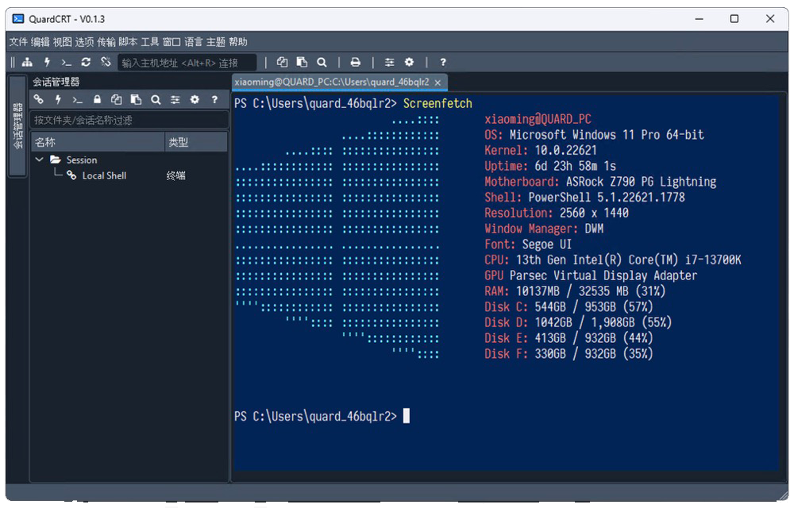
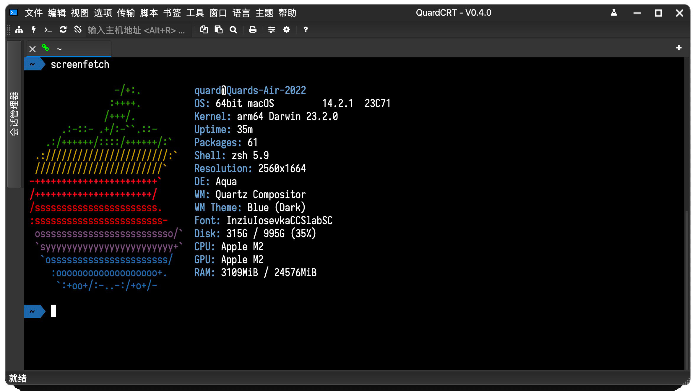
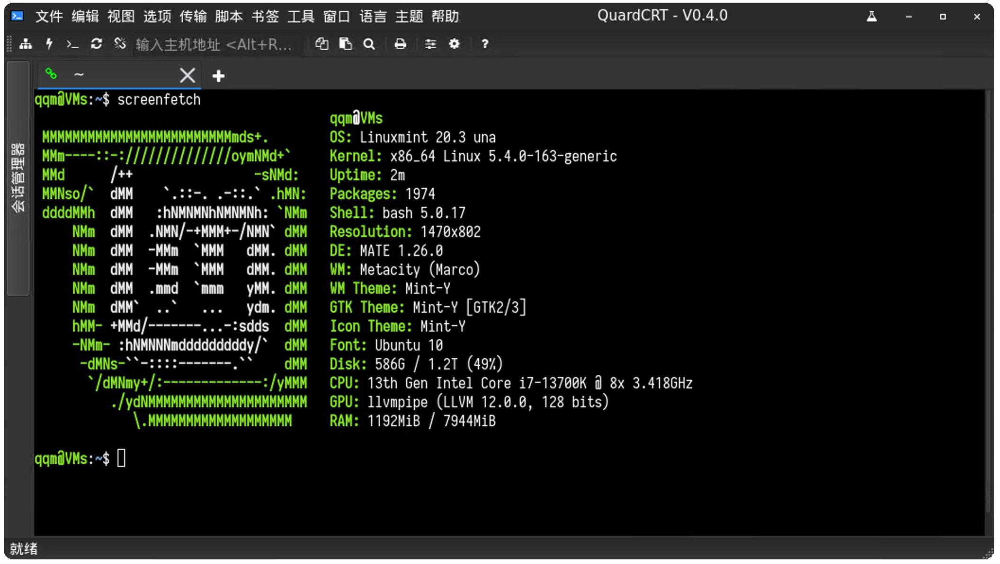
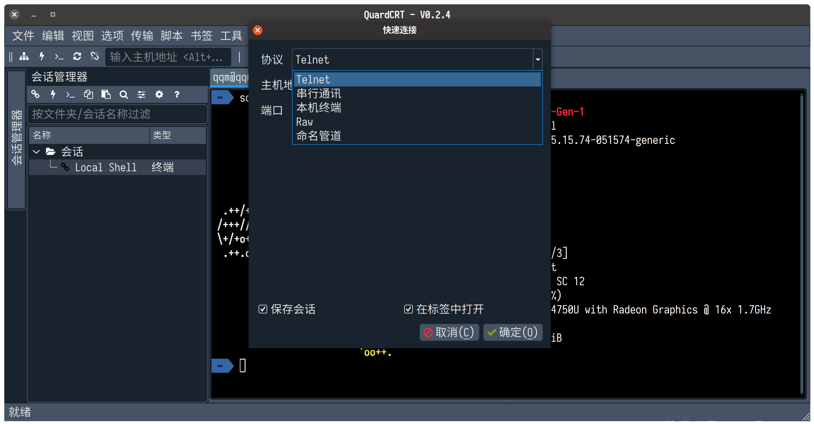

# quardCRT

English | [简体中文](./README_zh_CN.md)

quardCRT is a terminal emulation software that supports multiple backend protocols, can be used across platforms without dependencies, and has a completely consistent user experience on windows/linux/mac. It supports multiple tabs and history management.

|  |
| :-------------------------: |
| Windows                     |
|    |
| MacOS                       |
|    |
| Linux                       |

Other protocol selection interface:

## Feature

- Currently supported terminal protocols include:

    - telnet (Support websocket wrapper)
    - serial
    - loaclshell
    - rawsocket
    - windows:NamedPipe（linux/macos:unix domain socket）

- Multi-tab management, tab cloning, tab drag-and-drop sorting
- Dual column split screen
- Working directory bookmark
- Automated sending
- HEX display
- Session history management
- Terminal style configuration (color scheme, font)
- Terminal background image configuration (support transparency setting, support gif animation and video)
- Terminal scroll line configuration
- Support dark/light theme
- Support multiple languages (Chinese/English/Japanese)

## Contributing

If you have suggestions or ideas for this project, please submit issues and pull requests on GitHub or Gitee.

The current project is recommended to use version Qt6.2.0 and above.

## Special

The project is currently developed in my spare time. In order to improve the development efficiency, this project uses GitHub Copilot to assist in code writing. The readability of some code may not be very good, and the author will try to optimize it in subsequent versions.

## Thanks

The code of this project references or partially refers to or depends on the following open source projects. The project fully respects the open source agreement of the original project and would like to express its gratitude.

- [QDarkStyleSheet](https://github.com/ColinDuquesnoy/QDarkStyleSheet)
- [QFontIcon](https://github.com/dridk/QFontIcon)
- [QTelnet](https://github.com/silderan/QTelnet)
- [qtermwidget](https://github.com/lxqt/qtermwidget)
- [ptyqt](https://github.com/kafeg/ptyqt)
- [argv_split](https://github.com/bitmeal/argv_split)
- [iTerm2-Color-Schemes](https://github.com/mbadolato/iTerm2-Color-Schemes)
- [winpty](https://github.com/rprichard/winpty)
- [QtFancyTabWidget](https://github.com/SM-nzberg/QtFancyTabWidget)
- [qtftp](https://github.com/teknoraver/qtftp)
- [utf8proc](https://github.com/JuliaStrings/utf8proc)
- [fcitx-qt5](https://github.com/fcitx/fcitx-qt5)
