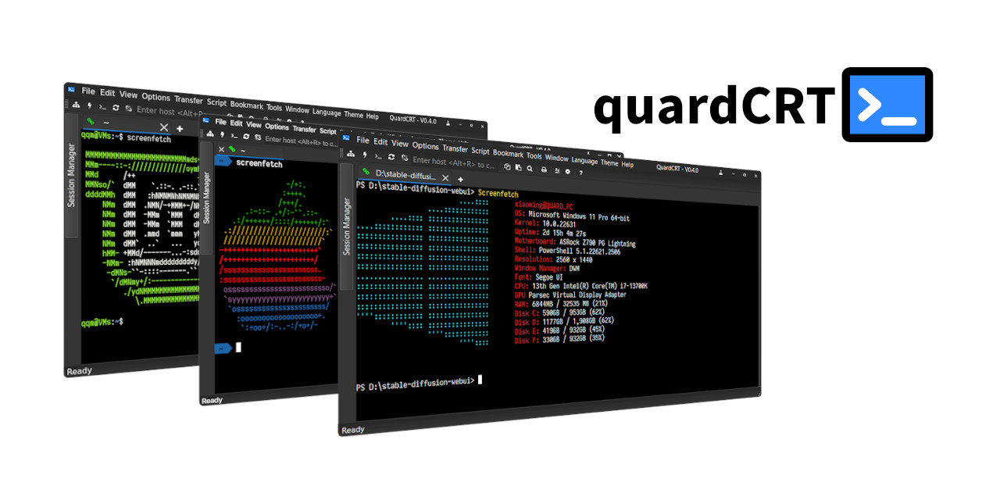
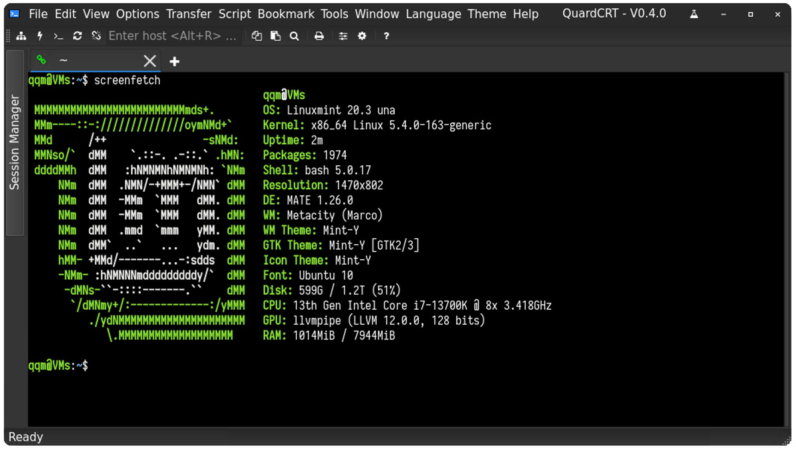
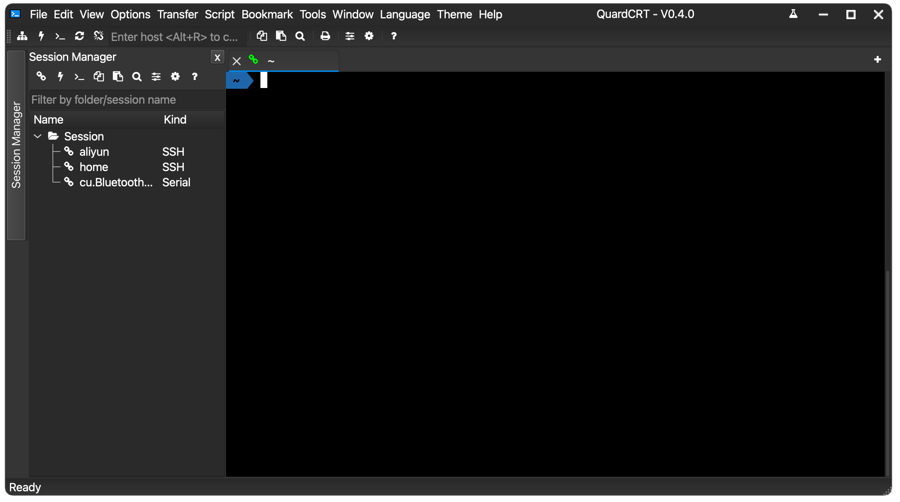
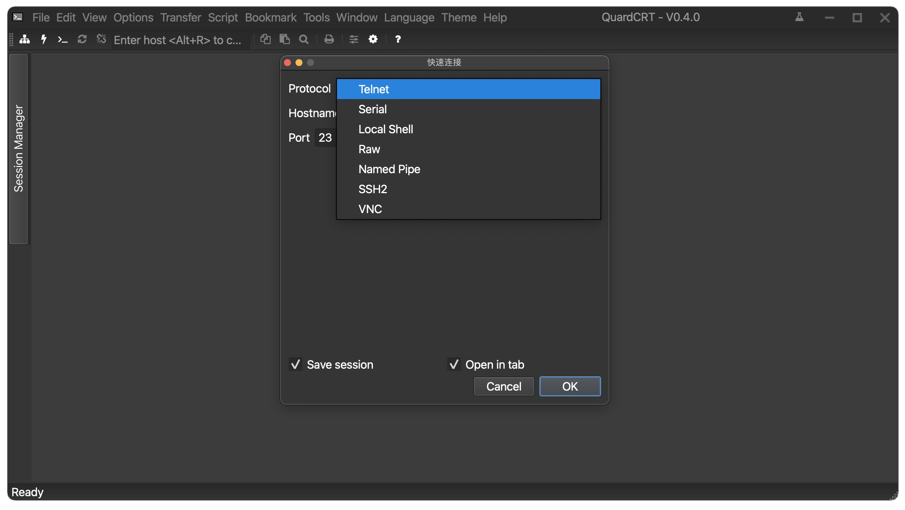

    
    <a href="https://spk-resolv.spark-app.store/?spk=spk://store/development/quardcrt">
        

            
            Spark Store から取得
        

    </a>

# quardCRT

[🇺🇸 English](./README.md) | [🇨🇳 简体中文](./README_zh_CN.md) | [🇭🇰 繁體中文](./README_zh_HK.md) | 🇯🇵 日本語

quardCRT は、複数のバックエンド プロトコルをサポートし、依存関係なくプラットフォーム間で使用でき、Windows/Linux/Mac 上で完全に一貫したユーザー エクスペリエンスを実現するターミナル エミュレーションおよびリモート デスクトップ ソフトウェアです。 マルチタブや履歴管理などの従来のターミナルソフトウェア機能をサポートし、いくつかの独自の詳細な機能をサポートします。quardCRT の設計目標は、可能な限りユーザーフレンドリーで機能豊富で、プラットフォーム間で一貫したエクスペリエンスを提供するターミナルソフトウェアを作成することです。多くの専門的な高性能ターミナルに比べて、quardCRT は、初心者や軽度のユーザーが必要なターミナル環境を迅速に設定するのに適していますが、これは quardCRT が高性能を追求していないことを意味するものではありません。

|  |
| :-------------------------: |
| Windows                     |
|    |
| MacOS                       |
|    |
| Linux                       |

ライト/ダーク テーマ切り替え:

|     |    |
| :-------------------------: | :-------------------------: |
| ダーク テーマ                | ライト テーマ               |

プロトコル選択インターフェイス:

## 機能

### 現在サポートされているターミナル プロトコル

- ssh
- telnet (websocket ラッパーをサポート)
- serial
- loaclshell
- rawsocket
- windows:NamedPipe（linux/macos:unix domain socket）

### 現在サポートされているリモート デスクトップ プロトコル

- vnc

### 基本機能

- セッション履歴管理
- マルチタブ管理、タブ複製、タブドラッグアンドドロップソート
- 最大 4 つの分割画面、複数のレイアウト モード、分割画面ページにタブを自由にドラッグ アンド ドロップできます
- ターミナル スタイルの構成 (カラー スキーム、カーソルの色)
- HEX 表示
- ターミナル背景画像の構成
- ターミナル スクロール行の構成
- Kermit x\y\zmodem プロトコルをサポート
- ANSI OSC52 シーケンスのサポート
- エコーのサポート
- ダーク/ライト テーマのサポート
- 複数言語のサポート (簡体字中国語/繁体字中国語/英語/日本語/韓国語/スペイン語/フランス語/ロシア語/ドイツ語/ポルトガル語(ブラジル)/チェコ語/アラビア語)

### 特別な機能

| タブ浮動プレビュー |
| :----------------: |
| <video src="https://github.com/QQxiaoming/quardCRT/assets/27486515/85935de5-d43c-4c17-9933-ac24d5cbe024"></video> |
| 浮動ウィンドウのサポート、タブのドラッグアンドドロップで浮動ウィンドウ |
| <video src="https://github.com/QQxiaoming/quardCRT/assets/27486515/bcc6454d-e5c1-4a45-84c5-fcd15d91dbd5"></video> |
| SSH2 セッションのワンクリックで SFTP ファイル転送ウィンドウを開く |
| <video src="https://github.com/QQxiaoming/quardCRT/assets/27486515/cbc8b080-f005-415a-9dd5-0c2805b758ad"></video> |
| 作業ディレクトリのブックマーク |
| <video src="https://github.com/QQxiaoming/quardCRT/assets/27486515/2cafced5-849e-4c0f-91b9-73ce83989e0d"></video> |
| 自動送信 |
| <video src="https://github.com/QQxiaoming/quardCRT/assets/27486515/57302b29-9d5f-41f2-808b-6fab6722be60"></video> |
| ターミナル背景画像は gif アニメーションとビデオをサポートします |
| <video src="https://github.com/QQxiaoming/quardCRT/assets/27486515/656c931e-801d-49fe-b1e1-ebc0be72608b"></video> |
| ターミナル キーワードのハイライト一致 |
| <video src="https://github.com/QQxiaoming/quardCRT/assets/27486515/ccf4b766-167d-4ba5-a09a-65bddced9e96"></video> |
| 選択したテキストの翻訳機能 |
| <video src="https://github.com/QQxiaoming/quardCRT/assets/27486515/e3f87a5b-ea05-43cb-850d-0077e8215902"></video> |
| パスの一致とワンクリック直接 |
| <video src="https://github.com/QQxiaoming/quardCRT/assets/27486515/cc02fc23-178a-4233-be27-da6419a3d56d"></video> |
| 作業パスの直接 |
| <video src="https://github.com/QQxiaoming/quardCRT/assets/27486515/7491a311-a207-4a92-b308-f6dbc2c750ab"></video> |
| Windows ローカル ターミナルの強化 (Tab キーで完全なコマンドを選択など) |
| <video src="https://github.com/QQxiaoming/quardCRT/assets/27486515/c54713a2-f4da-4ece-8b63-fb6f5d84076d"></video> |
| セッションのブロードキャスト |
|                                                                      |
| セッション ラベル タグの色 |
|                                                                      |
| ブロック選択 (Shift キーを押しながらクリック) と列選択 (Alt キーを押しながら Shift キーを押しながらクリック) |
|                                                                      |

## 計画された機能

- [ ] 操作スクリプトの記録/ロードをサポート
- [ ] スクリーン録画をサポート
- [ ] セッション状態のクエリ
- [x] ターミナル スタイルのカスタマイズ
- [ ] 独立したセッションはターミナルの外観を設定します
- [ ] GitHub Copilot プラグインのサポート
- [ ] CI サポート windows on arm64

## 翻訳

quardCRT は多言語をサポートし、現在以下の言語をサポートしています。翻訳カバレッジは以下の通りです：

| 🇺🇸 English   |  |
| :----------: | :------------------------: |
| 🇨🇳 简体中文  |  |
| 🇭🇰 繁體中文  |  |
| 🇯🇵 日本語    |  |
| 🇰🇷 한국어    |  |
| 🇪🇸 Español   |  |
| 🇫🇷 Français  |  |
| 🇷🇺 Русский   |  |
| 🇩🇪 Deutsch   |  |
| 🇧🇷 Português |  |
| 🇨🇿 čeština   |  |
| 🇸🇦 عربي     |  |

quartCRT の翻訳は github copilot によって支援されており、翻訳は非常に正確でないかもしれません。翻訳に問題がある場合は、issue または pull request を提出してください。

## プラグイン

quardCRT はバージョン V0.4.0 からプラグインをサポートします。プラグインは Qt プラグインの形式で提供され、動的ライブラリの形式でロードされます。プラグイン開発情報の詳細については、プラグインオープンプラットフォーム [https://github.com/QuardCRT-platform](https://github.com/QuardCRT-platform) を参照してください。このプラットフォームでは、プラグイン開発のテンプレートリポジトリと関連する例を提供します。現在、プラグイン機能はまだ開発初期の段階にあります。良いアイデアや提案があれば、GitHub または Gitee で issue または discussion を提出してください。

## ビルド

[DEVELOPNOTE.md](./DEVELOPNOTE.md) を参照してください。

## 貢献

このプロジェクトに対する提案やアイデアがある場合は、GitHub または Gitee で issue と pull request を提出してください。

既知の問題を改善/修正する場合は、[TODO](./TODO.md) を確認できます。

現在のプロジェクトは、バージョン Qt6.6.0 以上を使用することをお勧めします。

## 寄付

このプロジェクトが気に入ったら、作者に寄付してプロジェクトの開発をサポートできます。

|   |  |  |
| ------ | ------ | ------ |
| paypal | alipay | wechat |

## 特別な

このプロジェクトは現在、余暇時間で開発されています。開発効率を向上させるために、このプロジェクトでは GitHub Copilot を使用してコードを記述することが多く、一部のコードの可読性があまり良くないかもしれませんが、作者は後続のバージョンで最適化するように努めます。

## 感謝

このプロジェクトのコードは、以下のオープンソース プロジェクトを参照または部分的に参照または依存しています。プロジェクトは、元のプロジェクトのオープンソース契約を完全に尊重し、感謝の意を表明します。

- [QDarkStyleSheet](https://github.com/ColinDuquesnoy/QDarkStyleSheet)
- [QFontIcon](https://github.com/dridk/QFontIcon)
- [QTelnet](https://github.com/silderan/QTelnet)
- [qtermwidget](https://github.com/lxqt/qtermwidget)
- [ptyqt](https://github.com/kafeg/ptyqt)
- [argv_split](https://github.com/bitmeal/argv_split)
- [iTerm2-Color-Schemes](https://github.com/mbadolato/iTerm2-Color-Schemes)
- [winpty](https://github.com/rprichard/winpty)
- [QtFancyTabWidget](https://github.com/SM-nzberg/QtFancyTabWidget)
- [qtftp](https://github.com/teknoraver/qtftp)
- [utf8proc](https://github.com/JuliaStrings/utf8proc)
- [fcitx-qt5](https://github.com/fcitx/fcitx-qt5)
- [libssh2](https://github.com/libssh2/libssh2)
- [QtSsh](https://github.com/condo4/QtSsh)
- [QCustomFileSystemModel](https://github.com/QQxiaoming/QCustomFileSystemModel)
- [qtkeychain](https://github.com/frankosterfeld/qtkeychain)
- [qvncclient](https://bitbucket.org/amahta/qvncclient)
- [qhexedit](https://github.com/Simsys/qhexedit2)
- [QGoodWindow](https://github.com/antonypro/QGoodWindow)
- [qxymodem](https://github.com/QQxiaoming/qxymodem)
- [qzmodem](https://github.com/QQxiaoming/qzmodem)
- [Kermit-Protocol](https://github.com/tazlauanubianca/Kermit-Protocol)
- [QSourceHighlite](https://github.com/Waqar144/QSourceHighlite)
- [qextserialport](https://github.com/qextserialport/qextserialport)
- [Qt-QrCodeGenerator](https://github.com/alex-spataru/Qt-QrCodeGenerator)
- [sqlite3](https://www.sqlite.org)

## Star 歴史

<a href="https://star-history.com/#QQxiaoming/quardCRT&Date">
 <picture>
   <source media="(prefers-color-scheme: dark)" srcset="https://api.star-history.com/svg?repos=QQxiaoming/quardCRT&type=Date&theme=dark" />
   <source media="(prefers-color-scheme: light)" srcset="https://api.star-history.com/svg?repos=QQxiaoming/quardCRT&type=Date" />
   
 </picture>
</a>
