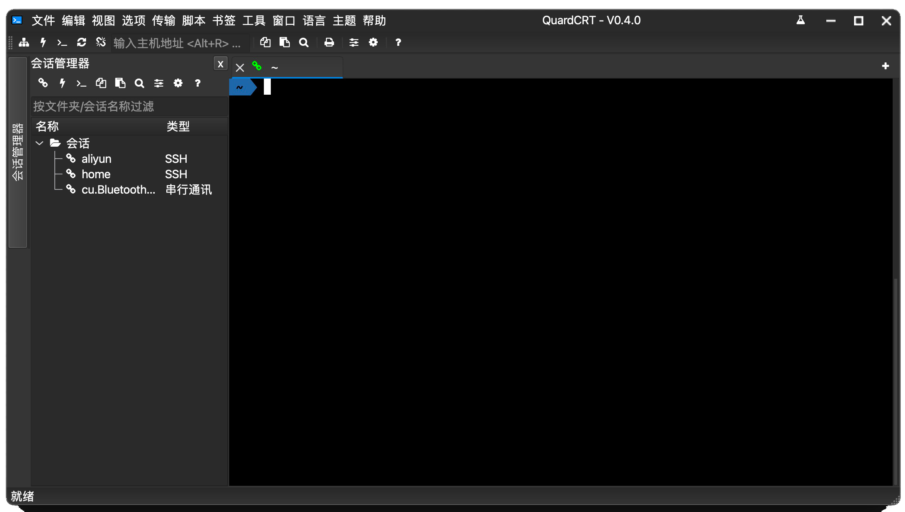
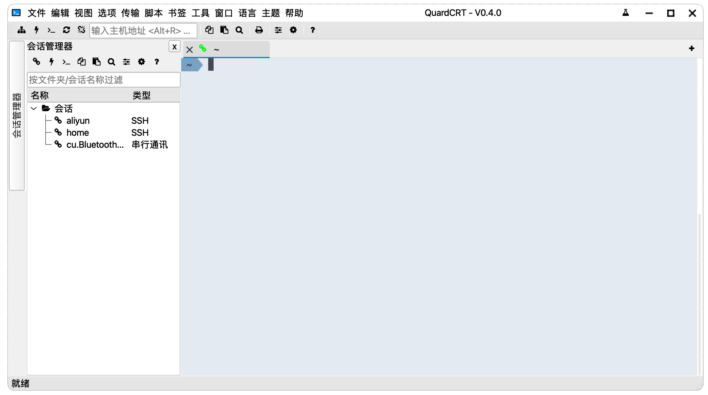

# quardCRT

[English](./README.md) | [简体中文](./README_zh_CN.md) | [繁體中文](./README_zh_HK.md) | 日本語

quardCRT は、複数のバックエンド プロトコルをサポートし、依存関係なくプラットフォーム間で使用でき、Windows/Linux/Mac 上で完全に一貫したユーザー エクスペリエンスを実現するターミナル エミュレーションおよびリモート デスクトップ ソフトウェアです。 マルチタブや履歴管理などの従来のターミナルソフトウェア機能をサポートし、いくつかの独自の詳細な機能をサポートします。

|  |
| :-------------------------: |
| Windows                     |
|    |
| MacOS                       |
|    |
| Linux                       |

ライト/ダーク テーマ切り替え:

|     |    |
| :-------------------------: | :-------------------------: |
| ダーク テーマ                | ライト テーマ               |

プロトコル選択インターフェイス:

## 機能

### 現在サポートされているターミナル プロトコル

- ssh
- telnet (websocket ラッパーをサポート)
- serial
- loaclshell
- rawsocket
- windows:NamedPipe（linux/macos:unix domain socket）

### 現在サポートされているリモート デスクトップ プロトコル

- vnc

### 基本機能

- セッション履歴管理
- マルチタブ管理、タブ複製、タブドラッグアンドドロップソート
- デュアル カラム分割画面、タブドラッグアンドドロップで列を分割
- ターミナル スタイルの構成 (カラー スキーム、フォント)
- HEX 表示
- ターミナル背景画像の構成
- ターミナル スクロール行の構成
- ダーク/ライト テーマのサポート
- 複数言語のサポート (簡体字中国語/繁体字中国語/英語/日本語/韓国語/スペイン語/フランス語/ロシア語)

### 特別な機能

| タブ浮動プレビュー |
| :----------------: |
| <video src="https://github.com/QQxiaoming/quardCRT/assets/27486515/5ecc8560-94ed-4d6e-90c4-7c18cce0db63"></video> |
| 浮動ウィンドウのサポート、タブのドラッグアンドドロップで浮動ウィンドウ |
| <video src="https://github.com/QQxiaoming/quardCRT/assets/27486515/15a9401a-5302-44c4-a693-e5e3043d8ca6"></video> |
| SSH2 セッションのワンクリックで SFTP ファイル転送ウィンドウを開く |
| <video src="https://github.com/QQxiaoming/quardCRT/assets/27486515/3097025c-3279-4c5b-b5fe-166607211dd9"></video> |
| 作業ディレクトリのブックマーク |
| <video src="https://github.com/QQxiaoming/quardCRT/assets/27486515/82a2866e-cf45-4933-8638-777f6baff682"></video> |
| 自動送信 |
| <video src="https://github.com/QQxiaoming/quardCRT/assets/27486515/59d05a59-31fd-4133-8dbe-deb43122fe8c"></video> |
| ターミナル背景画像は gif アニメーションとビデオをサポートします |
| <video src="https://github.com/QQxiaoming/quardCRT/assets/27486515/4fdb10c3-b754-4b1c-8dc3-bbe83d3b0fcf"></video> |
| ターミナル キーワードのハイライト一致 |
| <video src="https://github.com/QQxiaoming/quardCRT/assets/27486515/2d136273-8a53-4d4c-9cae-4609600bd32a"></video> |
| 選択したテキストの翻訳機能 |
| <video src="https://github.com/QQxiaoming/quardCRT/assets/27486515/aae7a324-808f-45e5-a86d-579d9002b28b"></video> |
| パスの一致とワンクリック直接 |
| <video src="https://github.com/QQxiaoming/quardCRT/assets/27486515/4aea9223-babd-4715-a908-56227ba04fed"></video> |
| 作業パスの直接 |
| <video src="https://github.com/QQxiaoming/quardCRT/assets/27486515/616c1c09-ffa1-428d-b897-1966ecb7517b"></video> |
| Windows ローカル ターミナルの強化 (Tab キーで完全なコマンドを選択など) |
| <video src="https://github.com/QQxiaoming/quardCRT/assets/27486515/f60eed90-5c77-48c9-9c14-71f4a3d993b9"></video> |

## 計画された機能

- [ ] xyzmodemプロトコルをサポート
- [ ] 操作スクリプトの記録/ロードをサポート
- [ ] スクリーン録画をサポート
- [ ] セッション状態のクエリ
- [ ] ターミナル スタイルのカスタマイズ
- [ ] 独立したセッションはターミナルの外観を設定します
- [ ] GitHub Copilot プラグインのサポート
- [x] CI サポート Appimage パッケージ
- [ ] CI サポート windows on arm64

## 翻訳

quardCRT は多言語をサポートし、現在以下の言語をサポートしています。翻訳カバレッジは以下の通りです：

| English  |  |
| :------: | :------------------------: |
| 简体中文 |  |
| 繁體中文 |  |
| 日本語   |  |
| 한국어   |  |
| Español   |  |
| Français   |  |
| Русский   |  |
| Deutsch   |  |
| Português   |  |
| čeština  |  |
| عربي    |  |

quartCRT の翻訳は github copilot によって支援されており、翻訳は非常に正確でないかもしれません。翻訳に問題がある場合は、issue または pull request を提出してください。

## プラグイン

quardCRT はバージョン V0.4.0 からプラグインをサポートします。プラグインは Qt プラグインの形式で提供され、動的ライブラリの形式でロードされます。プラグイン開発情報の詳細については、プラグインオープンプラットフォーム [https://github.com/QuardCRT-platform](https://github.com/QuardCRT-platform) を参照してください。このプラットフォームでは、プラグイン開発のテンプレートリポジトリと関連する例を提供します。現在、プラグイン機能はまだ開発初期の段階にあります。良いアイデアや提案があれば、GitHub または Gitee で issue または discussion を提出してください。

## ビルド

[DEVELOPNOTE.md](./DEVELOPNOTE.md) を参照してください。

## 貢献

このプロジェクトに対する提案やアイデアがある場合は、GitHub または Gitee で issue と pull request を提出してください。

既知の問題を改善/修正する場合は、[TODO](./TODO.md) を確認できます。

現在のプロジェクトは、バージョン Qt6.2.0 以上を使用することをお勧めします。

## 特別な

このプロジェクトは現在、余暇時間で開発されています。開発効率を向上させるために、このプロジェクトでは GitHub Copilot を使用してコードを記述することが多く、一部のコードの可読性があまり良くないかもしれませんが、作者は後続のバージョンで最適化するように努めます。

## 感謝

このプロジェクトのコードは、以下のオープンソース プロジェクトを参照または部分的に参照または依存しています。プロジェクトは、元のプロジェクトのオープンソース契約を完全に尊重し、感謝の意を表明します。

- [QDarkStyleSheet](https://github.com/ColinDuquesnoy/QDarkStyleSheet)
- [QFontIcon](https://github.com/dridk/QFontIcon)
- [QTelnet](https://github.com/silderan/QTelnet)
- [qtermwidget](https://github.com/lxqt/qtermwidget)
- [ptyqt](https://github.com/kafeg/ptyqt)
- [argv_split](https://github.com/bitmeal/argv_split)
- [iTerm2-Color-Schemes](https://github.com/mbadolato/iTerm2-Color-Schemes)
- [winpty](https://github.com/rprichard/winpty)
- [QtFancyTabWidget](https://github.com/SM-nzberg/QtFancyTabWidget)
- [qtftp](https://github.com/teknoraver/qtftp)
- [utf8proc](https://github.com/JuliaStrings/utf8proc)
- [fcitx-qt5](https://github.com/fcitx/fcitx-qt5)
- [libssh2](https://github.com/libssh2/libssh2)
- [QtSsh](https://github.com/condo4/QtSsh)
- [QCustomFileSystemModel](https://github.com/QQxiaoming/QCustomFileSystemModel)
- [qtkeychain](https://github.com/frankosterfeld/qtkeychain)
- [qvncclient](https://bitbucket.org/amahta/qvncclient)
- [qhexedit](https://github.com/Simsys/qhexedit2)
- [QGoodWindow](https://github.com/antonypro/QGoodWindow)
