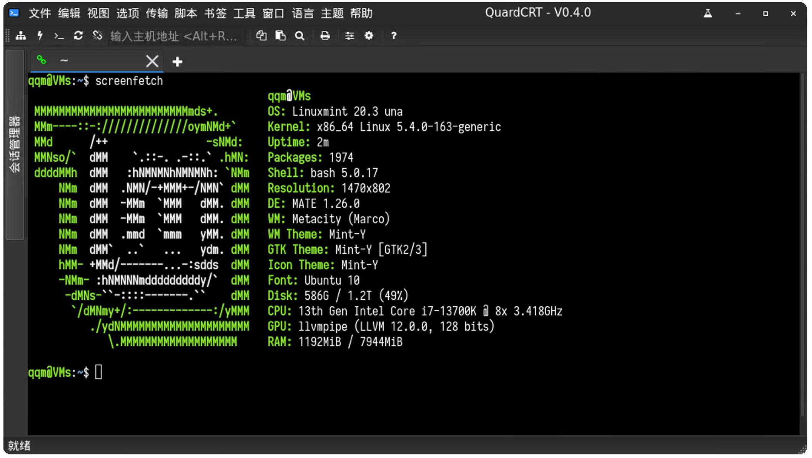
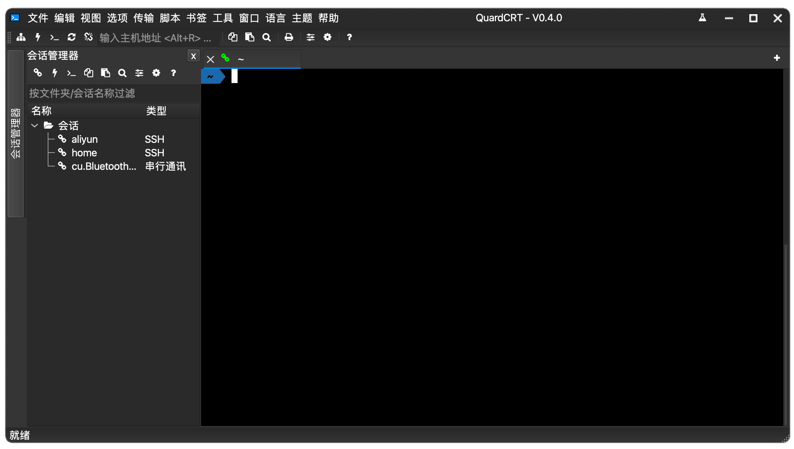

    
    <a href="https://spk-resolv.spark-app.store/?spk=spk://store/development/quardcrt">
        

            
            从Spark Store获取
        

    </a>

# quardCRT

[🇺🇸 English](./README.md) | 🇨🇳 简体中文 | [🇭🇰 繁體中文](./README_zh_HK.md) | [🇯🇵 日本語](./README_ja_JP.md)

quardCRT一款多功能终端仿真/图形桌面软件，支持多种后端协议，无依赖跨平台使用，windows/linux/mac使用体验完全一致，支持多标签页和历史记录管理等传统终端软件功能，同时支持一些独具特色的细节功能。quardCRT的设计宗旨是创建尽可能用户友好、功能丰富、且跨平台一致性体验的终端软件，相比很多专业高性能终端，quardCRT会更适合入门、轻度用户快速的配置好所需的终端环境，但这也并不意味quardCRT不追求高性能。

|  |
| :-------------------------: |
| Windows                     |
|    |
| MacOS                       |
|    |
| Linux                       |

亮/暗主题切换：

|     |    |
| :-------------------------: | :-------------------------: |
| 暗主题                      | 亮主题                      |

协议选择界面：

## 功能描述

### 目前支持的终端协议

- ssh
- telnet (支持带websocket封装)
- serial
- loaclshell
- rawsocket
- windows:NamedPipe（linux/macos:unix domain socket）

### 目前支持的图形桌面协议

- vnc

### 基本功能

- 会话记录管理
- 多标签页管理，标签页克隆，标签页拖拽排序
- 最多 4 个分屏，多种布局模式，可通过自由拖放选项卡至分屏页
- 终端样式配置（配色方案、字体、光标颜色）
- HEX显示
- 终端背景图片配置
- 终端滚动行配置
- 支持 kermit x\y\zmodem 协议
- 支持 ANSI OSC52 序列
- 支持回显
- 支持深色/浅色主题
- UI支持多语言（简体中文/繁体中文/英语/日语/韩语/西班牙语/法语/俄语/德语/葡萄牙语(巴西)/捷克语/阿拉伯语）

### 特色功能 （带视频演示，需要前往github查看）

| 标签页悬浮预览 |
| :------------: |
| <video src="https://github.com/QQxiaoming/quardCRT/assets/27486515/85935de5-d43c-4c17-9933-ac24d5cbe024"></video> |
| 浮动窗口支持，可将标签页拖拽至浮动窗口 |
| <video src="https://github.com/QQxiaoming/quardCRT/assets/27486515/bcc6454d-e5c1-4a45-84c5-fcd15d91dbd5"></video> |
| SSH2会话一键打开SFTP文件传输窗口 |
| <video src="https://github.com/QQxiaoming/quardCRT/assets/27486515/cbc8b080-f005-415a-9dd5-0c2805b758ad"></video> |
| 本地终端工作目录书签 |
| <video src="https://github.com/QQxiaoming/quardCRT/assets/27486515/2cafced5-849e-4c0f-91b9-73ce83989e0d"></video> |
| 自动化发送 |
| <video src="https://github.com/QQxiaoming/quardCRT/assets/27486515/57302b29-9d5f-41f2-808b-6fab6722be60"></video> |
| 终端背景图片支持gif动画和视频 |
| <video src="https://github.com/QQxiaoming/quardCRT/assets/27486515/656c931e-801d-49fe-b1e1-ebc0be72608b"></video> |
| 终端关键词高亮匹配 |
| <video src="https://github.com/QQxiaoming/quardCRT/assets/27486515/ccf4b766-167d-4ba5-a09a-65bddced9e96"></video> |
| 选中文本翻译功能 |
| <video src="https://github.com/QQxiaoming/quardCRT/assets/27486515/e3f87a5b-ea05-43cb-850d-0077e8215902"></video> |
| 路径匹配与一键直达 |
| <video src="https://github.com/QQxiaoming/quardCRT/assets/27486515/cc02fc23-178a-4233-be27-da6419a3d56d"></video> |
| 工作路径直达 |
| <video src="https://github.com/QQxiaoming/quardCRT/assets/27486515/7491a311-a207-4a92-b308-f6dbc2c750ab"></video> |
| windows本地终端增强（Tab键选择补全命令等） |
| <video src="https://github.com/QQxiaoming/quardCRT/assets/27486515/c54713a2-f4da-4ece-8b63-fb6f5d84076d"></video> |
| 广播会话 |
|          |
| 会话标签颜色 |
|          |
| 块选择（Shift+单击）和列选择（Alt+Shift+单击）|
|          |

## 计划中特性

- [ ] 支持操作脚本录制/加载
- [ ] 支持终端显示录制
- [ ] 会话状态查询
- [x] 终端样式自定义
- [ ] 独立会话设置终端外观
- [ ] GitHub Copilot插件支持
- [ ] CI支持windows on arm64

## 翻译

quardCRT支持多语言，目前支持以下语言，翻译覆盖率如下：

| 🇺🇸 English   |  |
| :----------: | :------------------------: |
| 🇨🇳 简体中文  |  |
| 🇭🇰 繁體中文  |  |
| 🇯🇵 日本語    |  |
| 🇰🇷 한국어    |  |
| 🇪🇸 Español   |  |
| 🇫🇷 Français  |  |
| 🇷🇺 Русский   |  |
| 🇩🇪 Deutsch   |  |
| 🇧🇷 Português |  |
| 🇨🇿 čeština   |  |
| 🇸🇦 عربي     |  |

quardCRT的翻译由github copilot协助翻译，翻译可能不是很准确，如果您发现翻译有问题，欢迎提交issue或pull request。

## 插件

quardCRT将从V0.4.0版本开始支持插件，插件将以Qt Plug-in插件的形式提供，以动态库的形式加载，想了解更多插件开发信息请参考插件开放平台[https://github.com/QuardCRT-platform](https://github.com/QuardCRT-platform)，此平台将提供插件开发的模板仓库以及相关示例。目前插件功能仍处于早期开发阶段，如果您有好的想法或建议，欢迎在GitHub或Gitee上提交issue或discussion。

## 编译说明

请参考[开发笔记](./DEVELOPNOTE_zh_CN.md)。

## 贡献

如果您对本项目有建议或想法，欢迎在GitHub或Gitee上提交issue和pull requests。

如果您希望改进/修复目前已知的问题，您可以查看[TODO](./TODO.md)。

目前项目建议使用版本Qt6.6.0及更高版本。

## 捐赠

如果您觉得本项目对您有帮助，您可以通过以下方式捐赠：

|   |  |  |
| ------ | ------ | ------ |
| paypal | alipay | wechat |

## 特别

项目目前为个人业余时间开发，为提高开发效率，本项目较为大量的使用了GitHub Copilot协助代码编写，部分代码的人类可读性可能不是很好，作者也会尽量在后续版本中进行优化。

## 感谢

本项目代码引用或部份参考或依赖了以下开源项目，项目完全尊重原项目开源协议，并在此表示感谢。

- [QDarkStyleSheet](https://github.com/ColinDuquesnoy/QDarkStyleSheet)
- [QFontIcon](https://github.com/dridk/QFontIcon)
- [QTelnet](https://github.com/silderan/QTelnet)
- [qtermwidget](https://github.com/lxqt/qtermwidget)
- [ptyqt](https://github.com/kafeg/ptyqt)
- [argv_split](https://github.com/bitmeal/argv_split)
- [iTerm2-Color-Schemes](https://github.com/mbadolato/iTerm2-Color-Schemes)
- [winpty](https://github.com/rprichard/winpty)
- [QtFancyTabWidget](https://github.com/SM-nzberg/QtFancyTabWidget)
- [qtftp](https://github.com/teknoraver/qtftp)
- [utf8proc](https://github.com/JuliaStrings/utf8proc)
- [fcitx-qt5](https://github.com/fcitx/fcitx-qt5)
- [libssh2](https://github.com/libssh2/libssh2)
- [QtSsh](https://github.com/condo4/QtSsh)
- [QCustomFileSystemModel](https://github.com/QQxiaoming/QCustomFileSystemModel)
- [qtkeychain](https://github.com/frankosterfeld/qtkeychain)
- [qvncclient](https://bitbucket.org/amahta/qvncclient)
- [qhexedit](https://github.com/Simsys/qhexedit2)
- [QGoodWindow](https://github.com/antonypro/QGoodWindow)
- [qxymodem](https://github.com/QQxiaoming/qxymodem)
- [qzmodem](https://github.com/QQxiaoming/qzmodem)
- [Kermit-Protocol](https://github.com/tazlauanubianca/Kermit-Protocol)
- [QSourceHighlite](https://github.com/Waqar144/QSourceHighlite)
- [qextserialport](https://github.com/qextserialport/qextserialport)
- [Qt-QrCodeGenerator](https://github.com/alex-spataru/Qt-QrCodeGenerator)
- [sqlite3](https://www.sqlite.org)

## Star 历史

<a href="https://star-history.com/#QQxiaoming/quardCRT&Date">
 <picture>
   <source media="(prefers-color-scheme: dark)" srcset="https://api.star-history.com/svg?repos=QQxiaoming/quardCRT&type=Date&theme=dark" />
   <source media="(prefers-color-scheme: light)" srcset="https://api.star-history.com/svg?repos=QQxiaoming/quardCRT&type=Date" />
   
 </picture>
</a>
