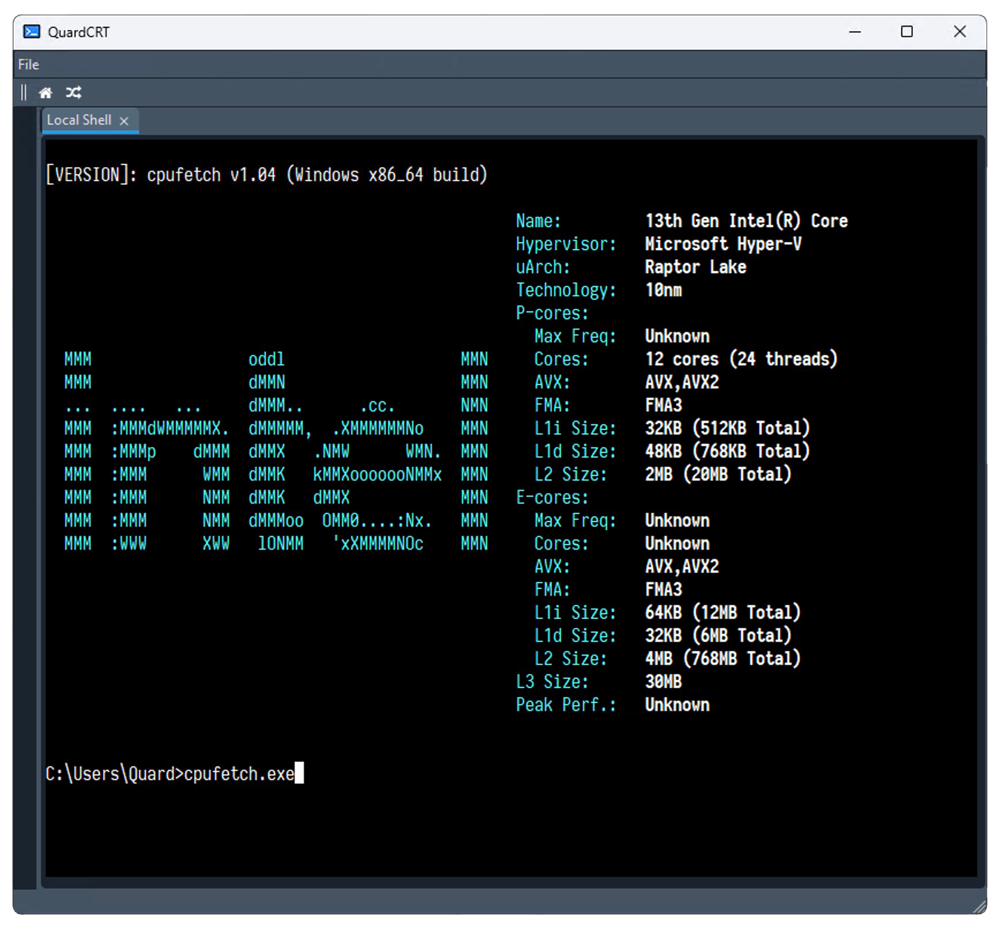
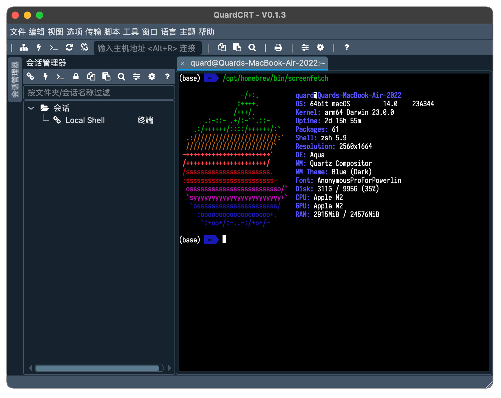
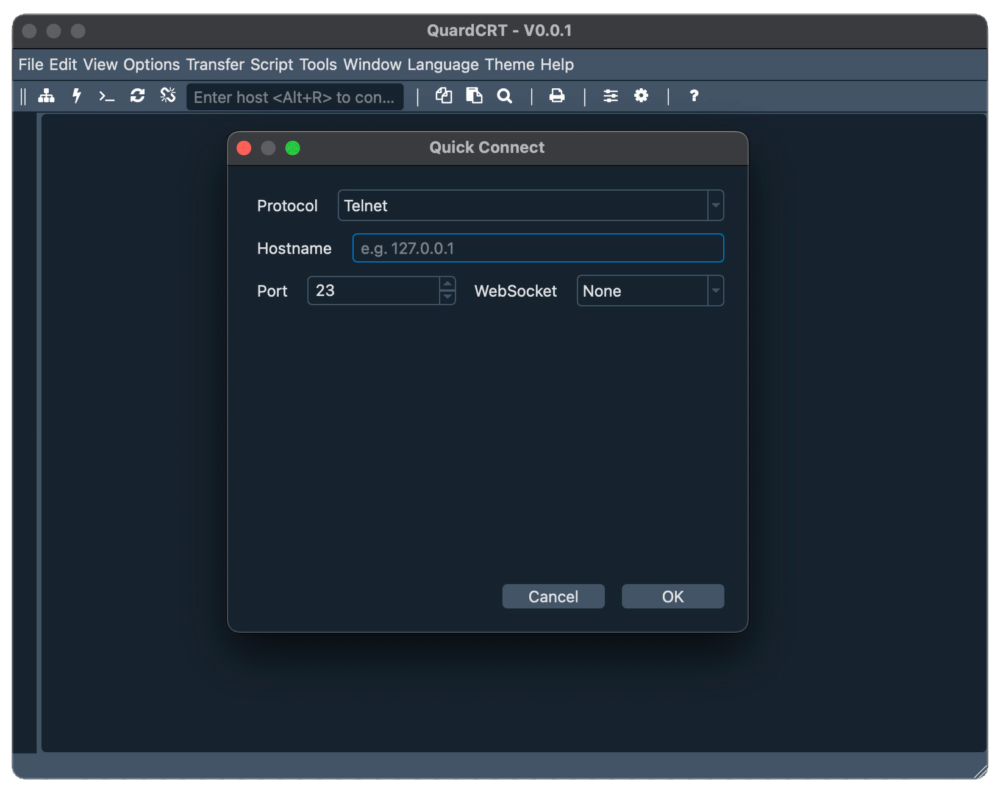

# quardCRT

[English](./README.md) | 简体中文

quardCRT一款终端仿真软件，支持多种后端协议，无依赖跨平台使用，windows/linux/mac使用体验完全一致，支持多标签页和历史记录管理。

|  |
| :----------------------: |
| Windows                  |
|  |
| MacOS                    |
|  |
| Linux                    |

其他协议选择界面：

## 功能描述

- 目前支持的终端协议包括：

    - telnet (支持带websocket封装)
    - serial
    - loaclshell
    - rawsocket

- 多标签页管理，标签页克隆，标签页拖拽排序
- 历史记录管理 (进行中)
- 终端样式配置
- 自定义字体 (进行中，目前固定等宽字体，大小可配置)

## 贡献

如果您对本项目有建议或想法，欢迎在GitHub或Gitee上提交issue和pull requests。

目前项目建议使用版本Qt6.2.0或更高版本。

## 感谢

本项目代码引用或部份参考或依赖了以下开源项目，项目完全尊重原项目开源协议，并在此表示感谢。

- [QDarkStyleSheet](https://github.com/ColinDuquesnoy/QDarkStyleSheet)
- [QFontIcon](https://github.com/dridk/QFontIcon)
- [QTelnet](https://github.com/silderan/QTelnet.git)
- [qtermwidget](https://github.com/lxqt/qtermwidget)
- [ptyqt](https://github.com/kafeg/ptyqt)
- [argv_split](https://github.com/bitmeal/argv_split)
- [iTerm2-Color-Schemes](https://github.com/mbadolato/iTerm2-Color-Schemes)
- [winpty](https://github.com/rprichard/winpty)
