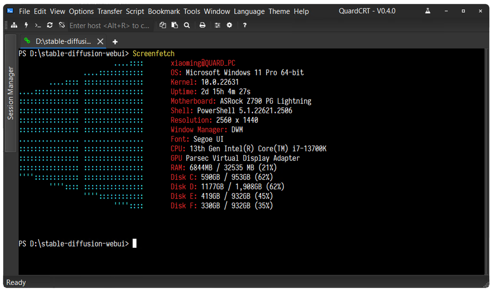
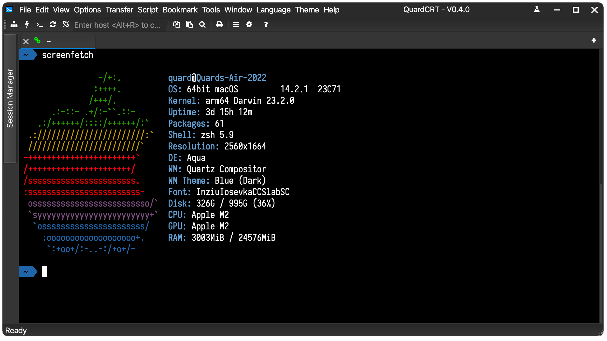
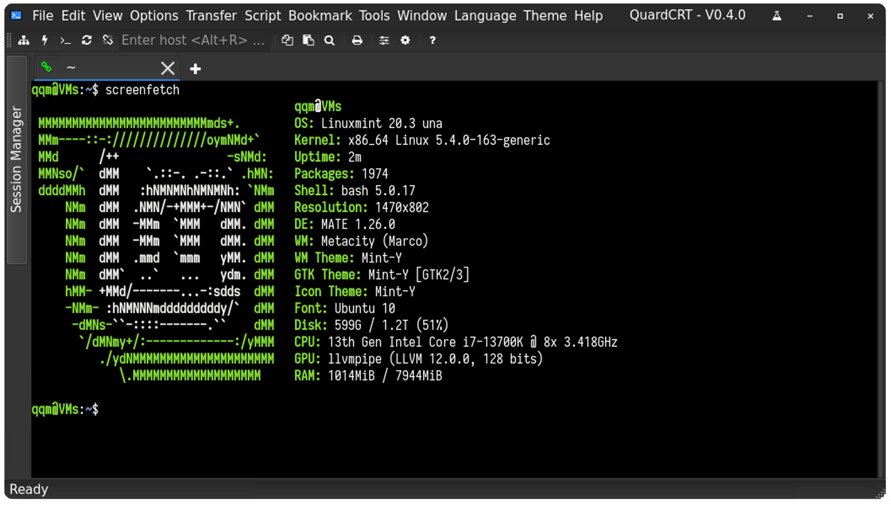
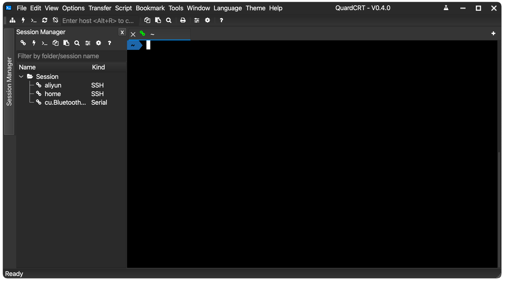
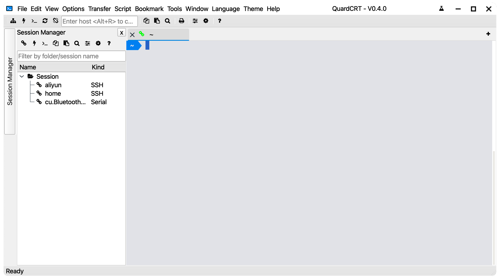

    
    <a href="https://spk-resolv.spark-app.store/?spk=spk://store/development/quardcrt">
        

            
            從Spark Store獲取
        

    </a>

# quardCRT

[🇺🇸 English](./README.md) | [🇨🇳 简体中文](./README_zh_CN.md) | 🇭🇰 繁體中文 | [🇯🇵 日本語](./README_ja_JP.md)

quardCRT一款多功能終端模擬/圖形桌面軟體，支援多種後端協議，無依賴跨平台使用，windows/linux/mac使用體驗完全一致，支援多標籤頁和歷史記錄管理等傳統終端軟體功能，同時支援一些獨具特色的細節功能。quardCRT的設計宗旨是創建盡可能用戶友好、功能豐富、且跨平台一致性體驗的終端軟體，相比很多專業高性能終端，quardCRT會更適合入門、輕度用戶快速的配置好所需的終端環境，但這也並不意味quardCRT不追求高性能。

|  |
| :-------------------------: |
| Windows                     |
|    |
| MacOS                       |
|    |
| Linux                       |

亮/暗主題切換：

|     |    |
| :-------------------------: | :-------------------------: |
| 暗主題                      | 亮主題                      |

協議選擇界面：

## 功能描述

### 目前支持的終端協議

- ssh
- telnet (支援帶websocket封裝)
- serial
- loaclshell
- rawsocket
- windows:NamedPipe（linux/macos:unix domain socket）

### 目前支持的圖形桌面協議

- vnc

### 基本功能

- 會話記錄管理
- 多標籤頁管理，標籤頁克隆，標籤頁拖拽排序
- 最多 4 個分割畫面，多種佈局模式，可透過自由拖放選項卡至分割畫面頁
- 終端樣式配置（配色方案，字體）
- HEX顯示
- 終端背景圖片配置
- 終端滾動線配置
- 支援kermit x\y\zmodem協議
- 支援ANSI OSC52序列
- 支援迴聲
- 支援深色/淺色主題
- UI支援多種語言（簡體中文/繁體中文/英語/日語/韓語/西班牙語/法語/俄語/德語/葡萄牙語（巴西）/捷克語/阿拉伯語）

### 特色功能 （帶視頻演示，需要前往github查看）

| 標籤頁懸浮預覽 |
| :------------: |
| <video src="https://github.com/QQxiaoming/quardCRT/assets/27486515/85935de5-d43c-4c17-9933-ac24d5cbe024"></video> |
| 浮動視窗支持，可將標籤頁拖曳至浮動窗口 |
| <video src="https://github.com/QQxiaoming/quardCRT/assets/27486515/bcc6454d-e5c1-4a45-84c5-fcd15d91dbd5"></video> |
| SSH2會話一鍵開啟SFTP檔案傳輸視窗 |
| <video src="https://github.com/QQxiaoming/quardCRT/assets/27486515/cbc8b080-f005-415a-9dd5-0c2805b758ad"></video> |
| 本地終端工作目錄書籤 |
| <video src="https://github.com/QQxiaoming/quardCRT/assets/27486515/2cafced5-849e-4c0f-91b9-73ce83989e0d"></video> |
| 自動化發送 |
| <video src="https://github.com/QQxiaoming/quardCRT/assets/27486515/57302b29-9d5f-41f2-808b-6fab6722be60"></video> |
| 終端機背景圖片支援gif動畫和視頻 |
| <video src="https://github.com/QQxiaoming/quardCRT/assets/27486515/656c931e-801d-49fe-b1e1-ebc0be72608b"></video> |
| 終端機關鍵詞高亮匹配 |
| <video src="https://github.com/QQxiaoming/quardCRT/assets/27486515/ccf4b766-167d-4ba5-a09a-65bddced9e96"></video> |
| 選中文本翻譯功能 |
| <video src="https://github.com/QQxiaoming/quardCRT/assets/27486515/e3f87a5b-ea05-43cb-850d-0077e8215902"></video> |
| 路徑匹配與一鍵直達 |
| <video src="https://github.com/QQxiaoming/quardCRT/assets/27486515/cc02fc23-178a-4233-be27-da6419a3d56d"></video> |
| 工作路徑直達 |
| <video src="https://github.com/QQxiaoming/quardCRT/assets/27486515/7491a311-a207-4a92-b308-f6dbc2c750ab"></video> |
| windows本地端增強（Tab鍵選擇補全指令等） |
| <video src="https://github.com/QQxiaoming/quardCRT/assets/27486515/c54713a2-f4da-4ece-8b63-fb6f5d84076d"></video> |
| 廣播會議 |
|  |
| 會話標籤標記顏色 |
|  |
| 區塊選擇（Shift+點擊）和列選擇（Alt+Shift+點擊）|
|  |

## 計劃中特性

- [ ] 支持操作腳本錄制/加載
- [ ] 支持終端顯示錄制
- [ ] 會話狀態查詢
- [x] 終端樣式自定義
- [ ] 獨立會話設置終端外觀
- [ ] GitHub Copilot插件支持
- [ ] CI支持windows on arm64

## 翻譯

quardCRT支持多語言，目前支持以下語言，翻譯覆蓋率如下：

| 🇺🇸 English   |  |
| :----------: | :------------------------: |
| 🇨🇳 简体中文  |  |
| 🇭🇰 繁體中文  |  |
| 🇯🇵 日本語    |  |
| 🇰🇷 한국어    |  |
| 🇪🇸 Español   |  |
| 🇫🇷 Français  |  |
| 🇷🇺 Русский   |  |
| 🇩🇪 Deutsch   |  |
| 🇧🇷 Português |  |
| 🇨🇿 čeština   |  |
| 🇸🇦 عربي     |  |

quardCRT的翻譯由github copilot協助翻譯，翻譯可能不是很準確，如果您發現翻譯有問題，歡迎提交issue或pull request。

## Plugin

quardCRT將從V0.4.0版本開始支持Plugin，以Qt Plug-in的形式提供，以動態庫的形式加載，想了解更多Plugin開發信息請參考Plugin開放平臺[https://github.com/QuardCRT-platform](https://github.com/QuardCRT-platform)，此平臺將提供Plugin開發的模板倉庫以及相關示例。目前Plugin功能仍處於早期開發階段，如果您有好的想法或建議，歡迎在GitHub或Gitee上提交issue或discussion。

## 編譯說明

請參考[開發筆記](./DEVELOPNOTE.md)。

## 貢獻

如果您對本項目有建議或想法，歡迎在GitHub或Gitee上提交issue和pull requests。

如果您希望改進/修復目前已知的問題，您可以查看[TODO](./TODO.md)。

目前項目建議使用版本Qt6.9.0及更高版本。

## 捐赠

如果您覺得本項目對您有幫助，您可以通過以下方式捐赠：

|   |  |  |
| ------ | ------ | ------ |
| paypal | alipay | wechat |

## 特別

項目目前為個人業餘時間開發，為提高開發效率，本項目較為大量的使用了GitHub Copilot協助程式碼編寫，部分程式碼的人類可讀性可能不是很好，作者也會盡量在後續版本中進行最佳化。

## 感謝

本項目程式碼引用或部份參考或依賴了以下開源項目，項目完全尊重原項目開源協議，並在此表示感謝。

- [QDarkStyleSheet](https://github.com/ColinDuquesnoy/QDarkStyleSheet)
- [QFontIcon](https://github.com/dridk/QFontIcon)
- [QTelnet](https://github.com/silderan/QTelnet)
- [qtermwidget](https://github.com/lxqt/qtermwidget)
- [ptyqt](https://github.com/kafeg/ptyqt)
- [argv_split](https://github.com/bitmeal/argv_split)
- [iTerm2-Color-Schemes](https://github.com/mbadolato/iTerm2-Color-Schemes)
- [winpty](https://github.com/rprichard/winpty)
- [QtFancyTabWidget](https://github.com/SM-nzberg/QtFancyTabWidget)
- [qtftp](https://github.com/teknoraver/qtftp)
- [utf8proc](https://github.com/JuliaStrings/utf8proc)
- [fcitx-qt5](https://github.com/fcitx/fcitx-qt5)
- [libssh2](https://github.com/libssh2/libssh2)
- [QtSsh](https://github.com/condo4/QtSsh)
- [QCustomFileSystemModel](https://github.com/QQxiaoming/QCustomFileSystemModel)
- [qtkeychain](https://github.com/frankosterfeld/qtkeychain)
- [qvncclient](https://bitbucket.org/amahta/qvncclient)
- [qhexedit](https://github.com/Simsys/qhexedit2)
- [QGoodWindow](https://github.com/antonypro/QGoodWindow)
- [qxymodem](https://github.com/QQxiaoming/qxymodem)
- [qzmodem](https://github.com/QQxiaoming/qzmodem)
- [Kermit-Protocol](https://github.com/tazlauanubianca/Kermit-Protocol)
- [QSourceHighlite](https://github.com/Waqar144/QSourceHighlite)
- [qextserialport](https://github.com/qextserialport/qextserialport)
- [Qt-QrCodeGenerator](https://github.com/alex-spataru/Qt-QrCodeGenerator)
- [spdlog](https://github.com/gabime/spdlog)
- [sqlite3](https://www.sqlite.org)

## Star 歷史

<a href="https://star-history.com/#QQxiaoming/quardCRT&Date">
 <picture>
   <source media="(prefers-color-scheme: dark)" srcset="https://api.star-history.com/svg?repos=QQxiaoming/quardCRT&type=Date&theme=dark" />
   <source media="(prefers-color-scheme: light)" srcset="https://api.star-history.com/svg?repos=QQxiaoming/quardCRT&type=Date" />
   
 </picture>
</a>
