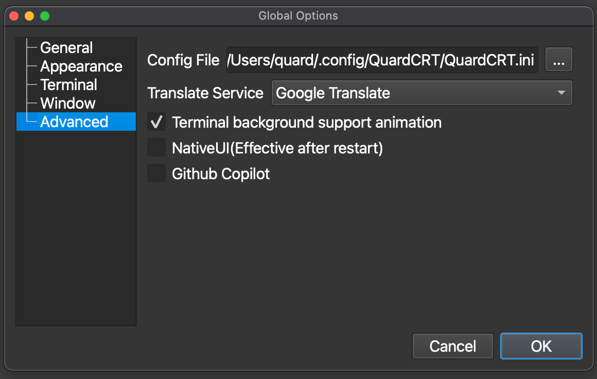

<a href="../../en/latest/configuration.html">🇺🇸 English</a> | <a href="../../zh-cn/latest/configuration.html">🇨🇳 简体中文</a> | <a href="../../zh-tw/latest/configuration.html">🇭🇰 繁體中文</a> | <a href="../../ja/latest/configuration.html">🇯🇵 日本語</a>

# Configuration

QuardCRT Includes global configuration and session configuration. Global configuration is the global setting of QuardCRT, which is persistently saved in the configuration file for the convenience of users' personalized use. Session configuration is used to temporarily adjust the settings of the current specific session.

## Global Configuration

First of all, the global configuration file of QuardCRT is located at `<user directory>/.config/QuardCRT/QuardCRT.ini`, you can also open the main interface of QuardCRT, select Options --> Global Options --> Advanced to view the current configuration file path.

The following introduces the various parts of the classified global configuration.

### General

General configuration includes some basic settings of QuardCRT.

- New Tab Mode

    New Tab Mode represents the way new tabs are opened when users use the tab ➕ button or shortcut keys to create new tabs. There are three modes to choose from:

    - New Session: Pop up the quick connect dialog, the user configures the connection information of the new tab, and generates a new session.
    - Clone Session: Copy the session information of the current tab, and generate a new session (if the hardware resources of the current tab are a single device, the quick connect dialog will pop up, and the user configures the hardware resource information that cannot be copied).
    - Local Shell: Generate a new local terminal session.

- New Tab Working Directory

    The working directory of the new session when the user creates a new local terminal session. By default, this option only contains one option: `User's home directory`. If you need to add other options, you need to add them to the directory bookmarks.

- Tab Title Mode

    Tab Title Mode represents the display mode of the tab title. There are three modes to choose from:

    - Brief: Fixed width display, does not display the complete session title.
    - Full: Display the complete session title.
    - Scroll: Display the complete session title, and when the title is too long, it will automatically scroll to display.

- Tab Title Width

    When the tab title mode is brief/scroll, the fixed width of the tab title. Unit: px.

- Tab Preview

    When the user hovers the mouse over the tab, the preview information of the tab is displayed.

- Preview Window Width

    The width of the tab preview window. Unit: px.

### Appearance

Appearance configuration includes the appearance settings of the terminal.

- Color Scheme

    QuardCRT provides dozens of color schemes for users to choose from, and users can choose the appropriate color scheme according to their preferences.

- Font
    
    The font settings of the terminal, including the font name and font size. Built-in represents the built-in font of QuardCRT, and users can also choose the fonts already installed in the system. The Built-in font selects a monospaced font suitable for programming. If the user needs to change the selected font to the Built-in font, they can click the cancel button when selecting the font to restore the Built-in font.

- Background Image

    The background image settings of the terminal, users can choose their favorite background image as the background of the terminal. Supported image formats include: bmp, jpg, jpeg, png, gif. Images in gif format will be displayed on the terminal background in the form of animation. If `Terminal Background Supports Animation` is checked in the advanced options, you can also choose mp4, avi, mov, wkv and other video formats as the background of the terminal, but this will consume a lot of system resources. Click the clear button to clear the current background image selection.

- Background Mode

    The background mode of the terminal, there are six modes to choose from:

    - None: Do not adjust the size of the background image.
    - Stretch: Stretch the background image to fit the size of the terminal.
    - Zoom: Scale the background image to fit the size of the terminal.
    - Fit: Keep the aspect ratio of the background image to make the background image fully displayed in the terminal.
    - Center: Display the background image in the center of the terminal.
    - Tile: Tile the background image to fill the entire terminal.

- Background Image Opacity

    The background transparency of the terminal, the value range is 0-100, 0 means completely transparent, 100 means completely opaque.

### Terminal

Terminal configuration includes some basic settings of the terminal.

- Scrollback Lines

    The scrollback lines of the terminal, which represents the maximum number of lines cached in the terminal. A larger value will consume more memory.

- Cursor Style

    The cursor style of the terminal, there are three styles to choose from:

    - Block: Display as a solid rectangular block.
    - Underline: Display as an underline.
    - I-Beam: Display as a vertical line.

- Cursor Blink

    The cursor blink of the terminal. Check to indicate that the cursor will blink.

- Word Characters

    Indicates which special characters are considered part of the word for double-click selection. By default: `@-./_~`.

### Window

Window configuration includes the window settings of QuardCRT.

- Window Opacity

    The transparency of the entire application window, the value range is 0-100, 0 means completely transparent, 100 means completely opaque.

### Advanced

Advanced configuration includes some advanced settings of QuardCRT.

- Configuration File Path

    The configuration file path of QuardCRT, users can view the current configuration file path here.

- Translation Service
    
    The translation service of QuardCRT, users can choose to use Google Translate\Baidu Translate\Bing Translate.

- Terminal Background Supports Animation

    Check to indicate that the terminal background supports animation, and users can choose mp4, avi, mov, wkv and other video formats as the background of the terminal, but this will consume a lot of system resources.

- Native UI

    Check to indicate the use of the native UI, mainly for MacOS users. After checking, QuardCRT's UI will be more in line with the style of MacOS. However, it is not recommended for multi-platform users to check to maintain the unified style and usage habits of QuardCRT. (This option needs to be restarted QuardCRT to take effect)

- Github Copilot

    This feature is not yet available, please look forward to it.
