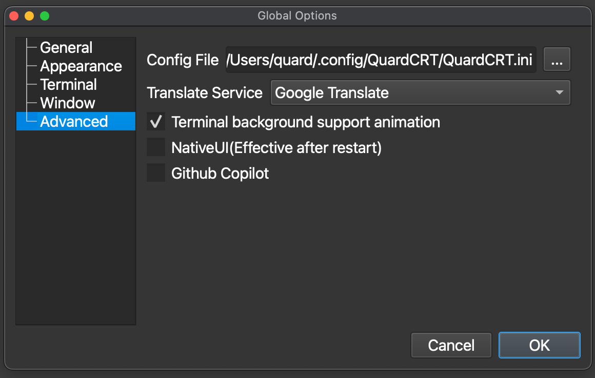

<a href="../../en/latest/configuration.html">🇺🇸 English</a> | <a href="../../zh-cn/latest/configuration.html">🇨🇳 简体中文</a> | <a href="../../zh-tw/latest/configuration.html">🇭🇰 繁體中文</a> | <a href="../../ja/latest/configuration.html">🇯🇵 日本語</a>

# Configuration

quardCRT has two layers of configuration:

- Global configuration: defaults and preferences that apply across the application.
- Session configuration: settings that affect the current session or a specific saved connection.

In practice, you usually start with global options for appearance and workflow defaults, then adjust session-specific settings only when a target requires different behavior.

## Global Configuration

The global configuration file is typically stored under your user profile, for example at `<user directory>/.config/QuardCRT/QuardCRT.ini`. The most reliable way to confirm the active path on your machine is to open `Options > Global Options > Advanced` and read the `Configuration File Path` field.

For security-sensitive data such as saved passwords, quardCRT relies on the system keychain service instead of storing plain-text passwords in this configuration file. See the [FAQ](./faq.md) for details.

## How to choose between global and session settings

- Use global settings for items you want in every tab or most sessions, such as theme, font, scrollback size, transfer directories, and default window behavior.
- Use session settings when a single host or device needs a different protocol, port, baud rate, authentication mode, or terminal behavior.
- If you are unsure, change the global option first and only override it at the session level when necessary.

## Recommended starting points

Most new users typically review these sections first:

- `Appearance` to choose a theme, font, and optional background media.
- `Terminal` to set scrollback size, cursor behavior, and word selection behavior.
- `Transfer` to choose upload and download directories.
- `Advanced` to verify the configuration path and optional UI integrations.

The following sections describe each part of the global configuration in more detail.

### General

General controls how new tabs and previews behave across the application.

- New Tab Mode

    New Tab Mode represents the way new tabs are opened when users use the tab ➕ button or shortcut keys to create new tabs. There are three modes to choose from:

    - New Session: Pop up the quick connect dialog, the user configures the connection information of the new tab, and generates a new session.
    - Clone Session: Copy the session information of the current tab, and generate a new session (if the hardware resources of the current tab are a single device, the quick connect dialog will pop up, and the user configures the hardware resource information that cannot be copied).
    - Local Shell: Generate a new local terminal session.

- New Tab Working Directory

    The working directory of the new session when the user creates a new local terminal session. By default, this option only contains one option: `User's home directory`. If you need to add other options, you need to add them to the directory bookmarks.

- Tab Title Mode

    Tab Title Mode represents the display mode of the tab title. There are three modes to choose from:

    - Brief: Fixed width display, does not display the complete session title.
    - Full: Display the complete session title.
    - Scroll: Display the complete session title, and when the title is too long, it will automatically scroll to display.

- Tab Title Width

    When the tab title mode is brief/scroll, the fixed width of the tab title. Unit: px.

- Tab Preview

    When the user hovers the mouse over the tab, the preview information of the tab is displayed.

- Preview Window Width

    The width of the tab preview window. Unit: px.

### Appearance

Appearance controls the visual style of the terminal.

- Color Scheme

    QuardCRT provides dozens of color schemes for users to choose from, and users can choose the appropriate color scheme according to their preferences.

- Font
    
    The font settings of the terminal, including the font name and font size. Built-in represents the built-in font of QuardCRT, and users can also choose the fonts already installed in the system. The Built-in font selects a monospaced font suitable for programming. If the user needs to change the selected font to the Built-in font, they can click the cancel button when selecting the font to restore the Built-in font.

- Background Image

    Users can choose an image as the terminal background. Supported image formats include `bmp`, `jpg`, `jpeg`, `png`, and `gif`. GIF files are displayed as animated terminal backgrounds. If `Terminal Background Supports Animation` is enabled in `Advanced`, you can also choose video files such as `mp4`, `avi`, `mov`, and `mkv`, but this can noticeably increase resource usage. Use the clear button to remove the current background.

- Background Mode

    The background mode of the terminal, there are six modes to choose from:

    - None: Do not adjust the size of the background image.
    - Stretch: Stretch the background image to fit the size of the terminal.
    - Zoom: Scale the background image to fit the size of the terminal.
    - Fit: Keep the aspect ratio of the background image to make the background image fully displayed in the terminal.
    - Center: Display the background image in the center of the terminal.
    - Tile: Tile the background image to fill the entire terminal.

- Background Image Opacity

    The background transparency of the terminal, the value range is 0-100, 0 means completely transparent, 100 means completely opaque.

### Terminal

Terminal contains the core behavior settings for the terminal widget itself.

- Scrollback Lines

    The scrollback lines of the terminal, which represents the maximum number of lines cached in the terminal. A larger value will consume more memory.

- Cursor Style

    The cursor style of the terminal, there are three styles to choose from:

    - Block: Display as a solid rectangular block.
    - Underline: Display as an underline.
    - I-Beam: Display as a vertical line.

- Cursor Blink

    The cursor blink of the terminal. Check to indicate that the cursor will blink.

- Word Characters

    Indicates which special characters are considered part of the word for double-click selection. By default: `@-./_~`.

### Window

Window contains application-level window behavior.

- Window Opacity

    The transparency of the entire application window, the value range is 0-100, 0 means completely transparent, 100 means completely opaque.

### Transfer

Transfer sets the default paths and behavior for built-in file transfer features.

- Upload Directory

    The default upload directory of the file transfer function, which is the directory where the file is uploaded by default when the user uses the file transfer function.

- Download Directory

    The default download directory of the file transfer function, which is the directory where the file is downloaded by default when the user uses the file transfer function.

- X/Ymodem Send Packet Size

    The size of the data packet sent by X/Ymodem, the default value is 128.

- Zmodem Online

    Check to indicate that Zmodem is online, and the file transfer function will use Zmodem to transfer files.

### Advanced

Advanced contains configuration path visibility and opt-in features that may affect integration or performance.

- Configuration File Path

    The configuration file path of QuardCRT, users can view the current configuration file path here.

- Translation Service
    
    The translation service of QuardCRT, users can choose to use Google Translate\Baidu Translate\Bing Translate.

- Terminal Background Supports Animation

    Check to indicate that the terminal background supports animation, and users can choose mp4, avi, mov, wkv and other video formats as the background of the terminal, but this will consume a lot of system resources.

- Native UI

    Check to use the native UI, mainly for macOS users. After enabling it, quardCRT aligns more closely with the native macOS look and feel. Users who frequently move between operating systems may prefer to leave this disabled to keep a more uniform cross-platform interface. Restart quardCRT after changing this option.

- Github Copilot

    This feature is reserved for future use and is not currently available.

## Session configuration

Session configuration is useful when one connection needs settings that differ from your global defaults. Typical examples include:

- a serial device that requires a specific baud rate and flow control mode
- an SSH server that needs key-based authentication instead of a password
- a host that should always open with a specific name, protocol, or connection port

If you use the same target repeatedly, save it as a session after confirming the settings once.
