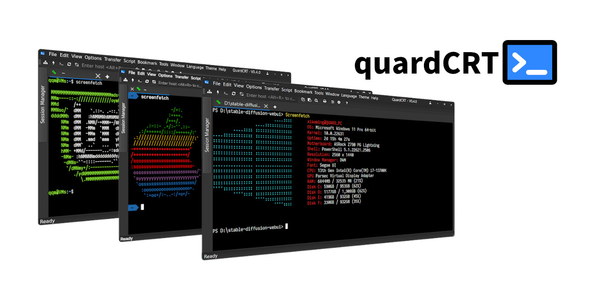

.. raw:: html

   
<a href="../../en/latest/index.html">🇺🇸 English</a> | <a href="../../zh-cn/latest/index.html">🇨🇳 简体中文</a> | <a href="../../zh-tw/latest/index.html">🇭🇰 繁體中文</a> | <a href="../../ja/latest/index.html">🇯🇵 日本語</a>

quardCRT
----------------------------------

.. image:: https://img.shields.io/github/actions/workflow/status/qqxiaoming/quardCRT/windows.yml?branch=main&logo=data:image/svg+xml;base64,PHN2ZyByb2xlPSJpbWciIHZpZXdCb3g9IjAgMCAyNCAyNCIgeG1sbnM9Imh0dHA6Ly93d3cudzMub3JnLzIwMDAvc3ZnIj48dGl0bGU+V2luZG93czwvdGl0bGU+PHBhdGggZD0iTTAsMEgxMS4zNzdWMTEuMzcySDBaTTEyLjYyMywwSDI0VjExLjM3MkgxMi42MjNaTTAsMTIuNjIzSDExLjM3N1YyNEgwWm0xMi42MjMsMEgyNFYyNEgxMi42MjMiIGZpbGw9IiNmZmZmZmYiLz48L3N2Zz4=
   :target: https://github.com/QQxiaoming/quardCRT/actions/workflows/windows.yml
   :alt: Windows ci
.. image:: https://img.shields.io/github/actions/workflow/status/qqxiaoming/quardCRT/linux.yml?branch=main&logo=linux&logoColor=white
   :target: https://github.com/QQxiaoming/quardCRT/actions/workflows/linux.yml
   :alt: Linux ci
.. image:: https://img.shields.io/github/actions/workflow/status/qqxiaoming/quardCRT/macos_arm64.yml?branch=main&logo=apple
   :target: https://github.com/QQxiaoming/quardCRT/actions/workflows/macos_arm64.yml
   :alt: Macos ci
.. image:: https://img.shields.io/codefactor/grade/github/qqxiaoming/quardCRT.svg?logo=codefactor
   :target: https://www.codefactor.io/repository/github/qqxiaoming/quardCRT
   :alt: CodeFactor
.. image:: https://img.shields.io/readthedocs/quardcrt.svg?logo=readthedocs
   :target: https://quardcrt.readthedocs.io/en/latest/?badge=latest
   :alt: Documentation Status
.. image:: https://img.shields.io/github/license/qqxiaoming/quardCRT.svg?colorB=f48041&logo=gnu
   :target: https://github.com/QQxiaoming/quardCRT
   :alt: License
.. image:: https://img.shields.io/github/v/tag/QQxiaoming/quardCRT?filter=V*&logo=git
   :target: https://github.com/QQxiaoming/quardCRT/releases
   :alt: GitHub tag (latest SemVer)
.. image:: https://img.shields.io/github/downloads/QQxiaoming/quardCRT/total.svg?logo=pinboard
   :target: https://github.com/QQxiaoming/quardCRT/releases
   :alt: GitHub All Releases
.. image:: https://img.shields.io/github/stars/QQxiaoming/quardCRT.svg?logo=github
   :target: https://github.com/QQxiaoming/quardCRT
   :alt: GitHub stars
.. image:: https://img.shields.io/github/forks/QQxiaoming/quardCRT.svg?logo=github
   :target: https://github.com/QQxiaoming/quardCRT
   :alt: GitHub forks
.. image:: https://gitee.com/QQxiaoming/quardCRT/badge/star.svg?theme=dark
   :target: https://gitee.com/QQxiaoming/quardCRT
   :alt: Gitee stars
.. image:: https://gitee.com/QQxiaoming/quardCRT/badge/fork.svg?theme=dark
   :target: https://gitee.com/QQxiaoming/quardCRT
   :alt: Gitee forks

quardCRT is a cross-platform terminal emulator and remote desktop client for Windows, Linux, and macOS. It focuses on a consistent user experience across platforms while still exposing the features expected from a modern daily-use terminal: multi-tab workflows, session management, file transfer, theming, language switching, and a growing plugin ecosystem.

quardCRT is designed for users who want a tool that is easy to start with, but still capable enough for regular development, embedded debugging, server maintenance, and light remote desktop work.

----------------------------------
Quick start
----------------------------------

1. Read the :doc:`installation guide <installation>` and choose the package that matches your platform.
2. Follow the :doc:`usage guide <usage>` to learn the main window layout, quick connection flow, and common operations.
3. Use the :doc:`configuration guide <configuration>` to tune global preferences such as appearance, terminal behavior, transfer directories, and advanced settings.

----------------------------------
What quardCRT provides
----------------------------------

- Cross-platform desktop client with a largely consistent workflow on Windows, Linux, and macOS
- Common terminal and remote access protocols in one application
- Saved sessions, tabbed workflows, split layouts, and floating windows
- File transfer support for SFTP, Xmodem, Ymodem, Zmodem, and Kermit
- User-facing customization for fonts, color schemes, cursor, scrollback, and background media
- Multi-language interface and plugin extensibility

.. list-table:: 
   :widths: 33 33 33
   :header-rows: 0

   * - .. image:: ./img/windows.png
          :align: center
          :height: 160px
     - .. image:: ./img/macos.png
          :align: center
          :height: 160px
     - .. image:: ./img/linux.png
          :align: center
          :height: 160px
   * - Windows
     - MacOS
     - Linux

----------------------------------
Features
----------------------------------

- **Cross-platform**: Windows, macOS, Linux
- **Protocols**: SSH, Telnet, Serial, Local Shell, Raw Socket, Named Pipe, VNC
- **Session workflows**: Multi-tab, multi-window, split view, floating window
- **Languages**: English, Simplified Chinese, Traditional Chinese, Japanese, Korean, Spanish, French, Russian, German, Portuguese (Brazil), Czech, Arabic
- **Themes**: Light and Dark
- **Session history**: History storage and quick search
- **Session management**: Create, save, organize, import, and export sessions
- **HEX display**: Inspect terminal output in hexadecimal form
- **File transfer**: SFTP, Xmodem, Ymodem, Zmodem, Kermit
- **Terminal customization**: Font, colors, cursor, scrollback, background image or video, and more

----------------------------------
Special functions
----------------------------------

- Tab floating preview
- Floating window support, tab drag-and-drop to floating window
- SSH2 session one-click open SFTP file transfer window
- Working directory bookmark
- Automated sending
- Terminal background image supports gif animation and video
- Terminal keyword highlight matching
- Selected text translation function
- Path matching and one-click direct
- Working path direct
- Windows local terminal enhancement (Tab key to select complete command, etc.)
- Broadcast session
- Session label tag color
- block selection (Shift+click) and column selection (Alt+Shift+click)

----------------------------------
Documentation guide
----------------------------------

- :doc:`Installation <installation>`: download sources, package selection, and platform-specific installation steps
- :doc:`Usage <usage>`: interface overview, first actions, menu and toolbar reference
- :doc:`Configuration <configuration>`: global options, session behavior, storage, and advanced settings
- :doc:`Scripts <scripts>`: scripting support and API overview
- :doc:`Plugins <plugins>`: plugin model, template project, and examples
- :doc:`FAQ <faq>`: licensing, privacy, and common questions

----------------------------------
Plugin
----------------------------------

quardCRT supports plugins from version V0.4.0. Plugins are provided as Qt plugins and loaded as dynamic libraries. For plugin development resources, templates, and examples, see the plugin `platform <https://github.com/QuardCRT-platform>`_. If you have ideas or suggestions for the plugin system, please open an issue or discussion on `GitHub <https://github.com/QQxiaoming/quardCRT>`_ or `Gitee <https://gitee.com/QQxiaoming/quardCRT>`_.

----------------------------------
Install from store
----------------------------------

- .. image:: https://get.microsoft.com/images/en-us%20dark.svg
   :target: https://apps.microsoft.com/detail/quardCRT/9p6102k9qb3t?mode=direct
   :alt: Microsoft Store

- .. image:: https://www.spark-app.store/assets/favicon-96x96-BB0Q9LsV.png
   :target: https://spk-resolv.spark-app.store/?spk=spk://store/development/quardcrt
   :alt: Spark Store

----------------------------------
Donate
----------------------------------

If you find quardCRT useful, you can support ongoing development with a donation.

.. list-table:: 
   :widths: 33 33 33
   :header-rows: 0

   * - .. image:: ./img/donate/paypal.jpg
          :align: center
     - .. image:: ./img/donate/alipay.jpg
          :align: center
     - .. image:: ./img/donate/wechat.jpg
          :align: center
   * - paypal
     - alipay
     - wechat

.. toctree::
   :maxdepth: 3
   :caption: Contents:

   Installation<installation.md>
   Usage<usage.md>
   Configuration<configuration.md>
   Scripts<scripts.md>
   Plugins<plugins.md>
   FAQ<faq.md>
   Contributing<contributing.md>
   Changelog<changelog.md>
   License<license.md>
   Roadmap<roadmap.md>
   Acknowledgements<acknowledgements.md>
   Privacy<privacy.md>
 