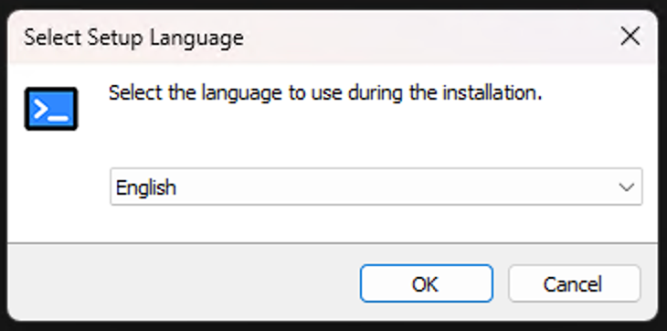
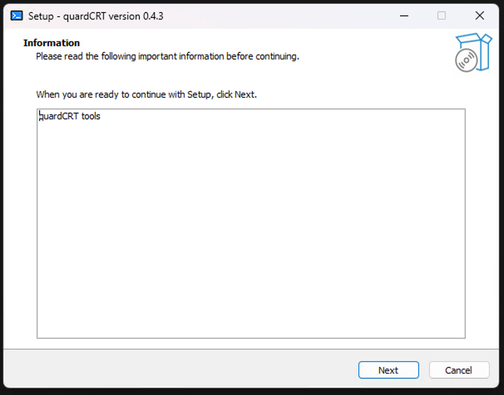
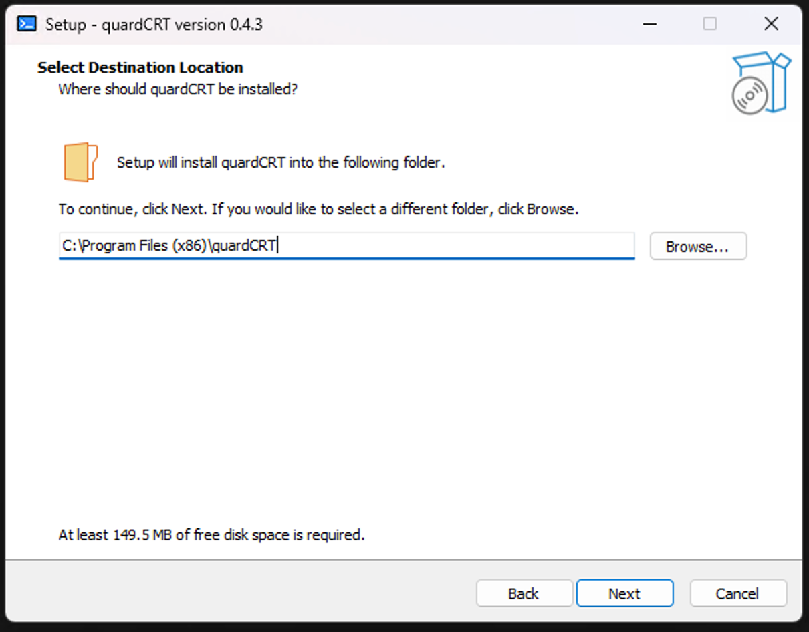
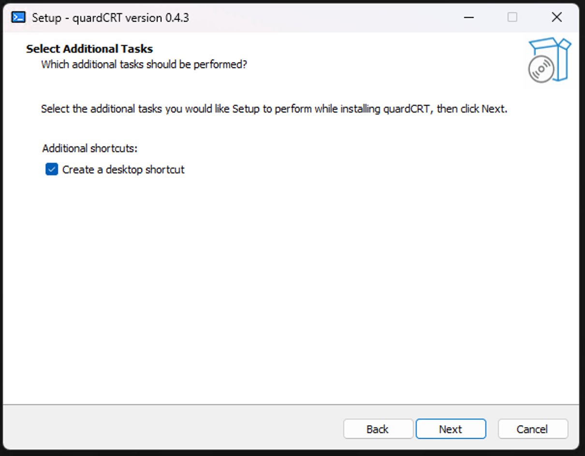
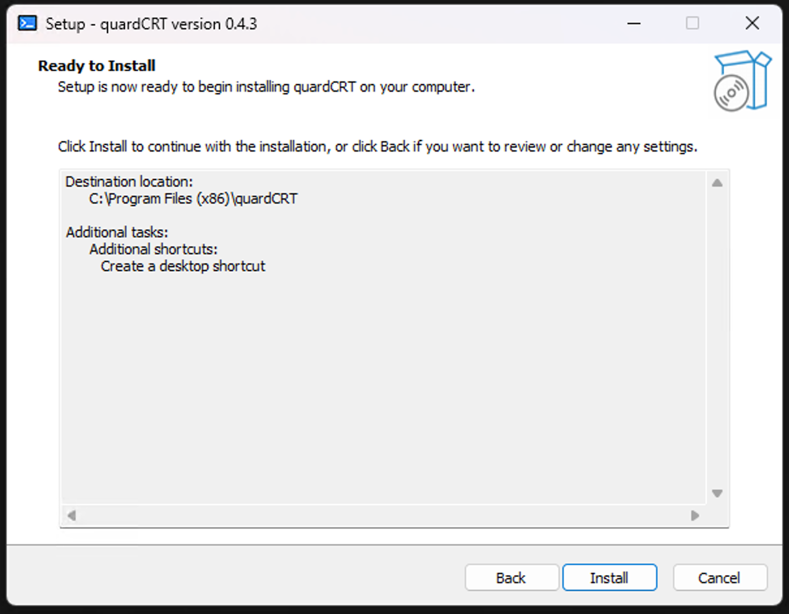
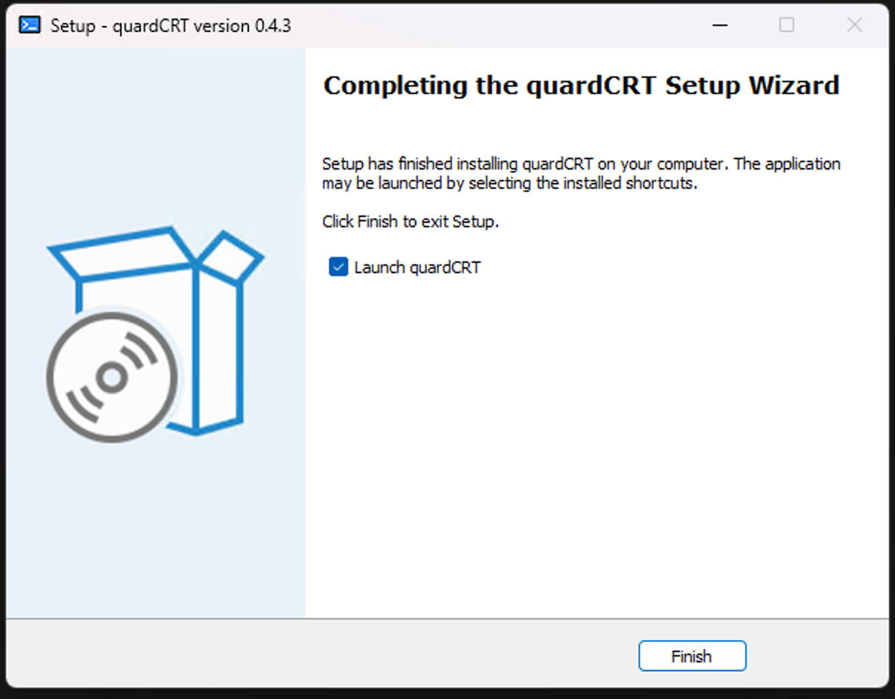
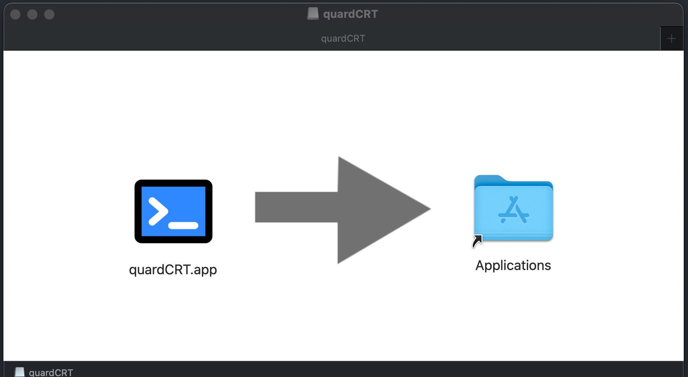
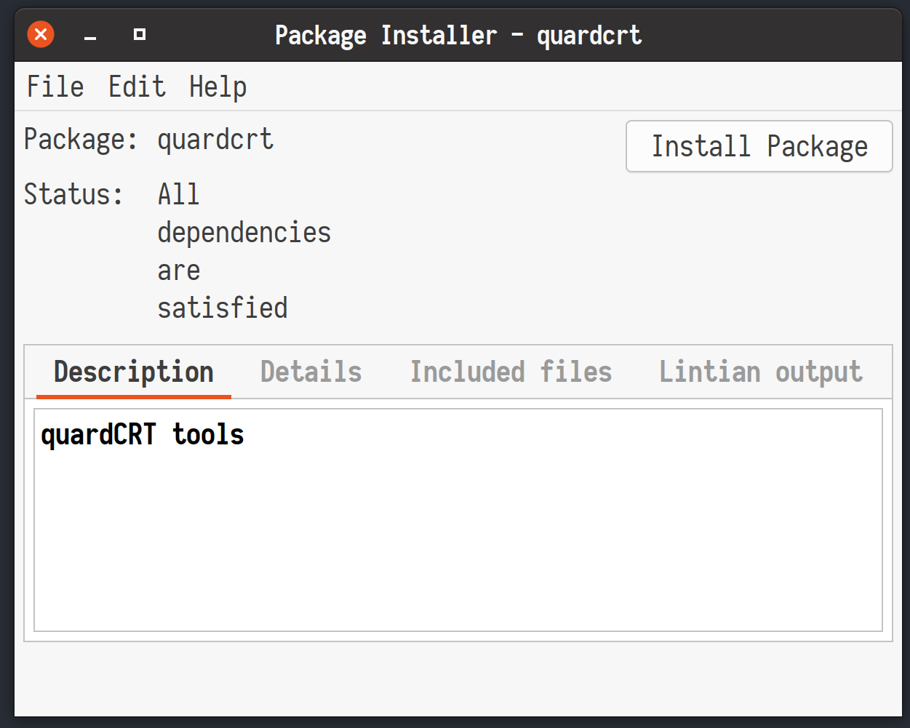
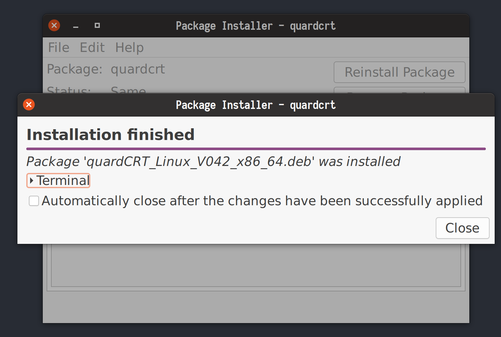

<div style="text-align: right"><a href="../../en/latest/installation.html">🇺🇸 English</a> | <a href="../../zh-cn/latest/installation.html">🇨🇳 简体中文</a> | <a href="../../zh-tw/latest/installation.html">🇭🇰 繁體中文</a> | <a href="../../ja/latest/installation.html">🇯🇵 日本語</a></div>

# Installation

quardCRT provides packages for Windows, macOS, and Linux. If your platform has an official app store entry, that is usually the simplest installation path. Otherwise, download a release package from GitHub, Gitee, or SourceForge.

## Before you download

- If you only want to install and use quardCRT, pick the package for your operating system and CPU architecture.
- If you plan to build or load native plugins on Windows, prefer the MSVC installer so the runtime matches a typical MSVC plugin toolchain.
- If you use Apple Silicon, choose the `arm64` macOS package.
- On Linux, use AppImage for a portable single-file launch or `deb` for package-managed installation on Debian-based systems.

## App Stores

quardCRT is currently available in the following app stores:

- [](https://apps.microsoft.com/detail/quardCRT/9p6102k9qb3t?mode=direct)
- [Spark Store](https://www.spark-app.store/store/application/quardcrt)
- Deepin Store

If your distribution or platform package store is not listed here, use the release packages below.

## Download

### All platforms

To download the latest version, use one of these release pages:

- [GitHub Releases](https://github.com/QQxiaoming/quardCRT/releases)
- [Gitee Releases](https://gitee.com/QQxiaoming/quardCRT/releases)
- [SourceForge](https://sourceforge.net/projects/quardcrt/files/)

Release assets are published in these package formats:

- Windows:
    - `quardCRT_windows_Vxxx_x86_64_setup.exe`
    - `quardCRT_windows_Vxxx_x86_64_msvc_setup.exe`
- macOS:
    - `quardCRT_macos_Vxxx_x86_64.dmg`
    - `quardCRT_macos_Vxxx_arm64.dmg`
- Linux:
    - `quardCRT_Linux_Vxxx_x86_64.AppImage`
    - `quardCRT_Linux_Vxxx_x86_64.deb`
- Source code:
    - `quardCRT_Vxxx_source.tar.gz`
    - `quardCRT_Vxxx_source.zip`

### Windows

Download either `quardCRT_windows_Vxxx_x86_64_setup.exe` or `quardCRT_windows_Vxxx_x86_64_msvc_setup.exe`.

- `setup.exe`: MinGW build with broad compatibility for regular end users.
- `msvc_setup.exe`: MSVC build, recommended if you need runtime compatibility with MSVC-built plugins or related native components.

#### Install

Run the installer and follow the setup wizard:

1. Select the language, and click `OK`.



2. Click `Next`.



3. Select the installation directory, and click `Next`.



4. Select the create shortcuts, and click `Next`.



5. Click `Install`.



6. Click `Finish`.



After installation, you can launch quardCRT from the Start menu or the optional desktop shortcut.

### macOS

Download `quardCRT_macos_Vxxx_x86_64.dmg` for Intel Macs or `quardCRT_macos_Vxxx_arm64.dmg` for Apple Silicon Macs.

#### Install

Open the DMG and install the app in the standard macOS way:

1. Double-click the `quardCRT` icon.
2. Drag the `quardCRT` icon to the `Applications` folder.



> Note: The prebuilt macOS packages are currently not signed by Apple. On first launch, macOS may warn that the app is from an unidentified developer. If you trust the downloaded package, you can remove the quarantine attribute with `xattr -cr /Applications/quardCRT.app`. If you do not trust the binary package, do not bypass the warning and build the project from source instead.

### Linux

For Linux, choose between:

- `quardCRT_Linux_Vxxx_x86_64.AppImage` for a portable single executable
- `quardCRT_Linux_Vxxx_x86_64.deb` for Debian, Ubuntu, Deepin, and other Debian-based distributions

#### Install

- AppImage

The AppImage package does not require installation. Mark it executable and run it directly:

```bash
chmod +x quardCRT_Linux_Vxxx_x86_64.AppImage
./quardCRT_Linux_Vxxx_x86_64.AppImage
```

- deb

You can install the Debian package with a graphical package manager or on the command line.

Graphical install:

1. Double-click the package.
2. Click `Install Package`.



3. Enter the password, and click `Authenticate`.
4. Click `Close`.



Command-line install:

```bash
sudo dpkg -i quardCRT_Linux_Vxxx_x86_64.deb
```

If your distribution reports dependency issues, use your package manager to resolve them, for example:

```bash
sudo apt install ./quardCRT_Linux_Vxxx_x86_64.deb
```

## First launch

After installation, the usual first steps are:

1. Open quardCRT.
2. Pick the application language if your platform package prompts for it.
3. Create a connection from the session manager or quick connect dialog.
4. Open `Options > Global Options` if you want to change theme, font, transfer paths, or advanced settings.

Continue with the [usage guide](./usage.md) for the main window layout and common workflows.
