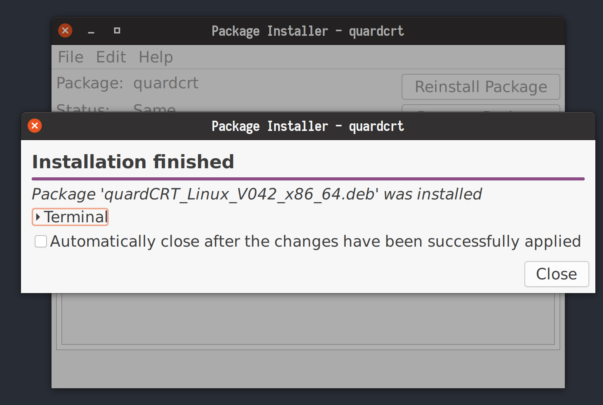

<div style="text-align: right"><a href="../../en/latest/installation.html">🇺🇸 English</a> | <a href="../../zh-cn/latest/installation.html">🇨🇳 简体中文</a> | <a href="../../zh-tw/latest/installation.html">🇭🇰 繁體中文</a> | <a href="../../ja/latest/installation.html">🇯🇵 日本語</a></div>

# Installation

QuardCRT is a cross-platform terminal emulator, it supports Windows, MacOS, and Linux. You can download the corresponding package according to your platform.

## Download

### All platforms

If you want to download the latest version of QuardCRT, you can go to the following links:

- [GitHub Releases](https://github.com/QQxiaoming/quardCRT/releases)
- [Gitee Releases](https://gitee.com/QQxiaoming/quardCRT/releases)
- [SourceForge](https://sourceforge.net/projects/quardcrt/files/)

You should download the corresponding package according to your platform. We provide the following packages:

- Windows: 
    - `quardCRT_windows_Vxxx_x86_64_setup.exe`
    - `quardCRT_windows_Vxxx_x86_64_msvc_setup.exe`
- MacOS: 
    - `quardCRT_macos_Vxxx_x86_64.dmg`
    - `quardCRT_macos_Vxxx_arm64.dmg`
- Linux: 
    - `quardCRT_Linux_Vxxx_x86_64.AppImage`
    - `quardCRT_Linux_Vxxx_x86_64.deb`
- Source code: 
    - `quardCRT_Vxxx_source.tar.gz`
    - `quardCRT_Vxxx_source.zip`

### Windows

If you are using Windows, you can download the `quardCRT_windows_Vxxx_x86_64_setup.exe` or `quardCRT_windows_Vxxx_x86_64_msvc_setup.exe` package. The `quardCRT_windows_Vxxx_x86_64_setup.exe` package is built with MinGW, and the `quardCRT_windows_Vxxx_x86_64_msvc_setup.exe` package is built with MSVC. You can choose the package according to your needs. If you don't care about custom plugins, you can choose the `quardCRT_windows_Vxxx_x86_64_setup.exe` package, which has better compatibility.

#### Install

You can install QuardCRT by double-clicking the package, and then follow the prompts to complete the installation.

1. Select the language, and click `OK`.


2. Click `Next`.


3. Select the installation directory, and click `Next`.


4. Select the create shortcuts, and click `Next`.


5. Click `Install`.


6. Click `Finish`.


### MacOS

If you are using MacOS, you can download the `quardCRT_macos_Vxxx_x86_64.dmg` or `quardCRT_macos_Vxxx_arm64.dmg` package. The `quardCRT_macos_Vxxx_x86_64.dmg` package is built with x86_64, and the `quardCRT_macos_Vxxx_arm64.dmg` package is built with arm64. If you are using an Apple Silicon Mac, you should choose the `quardCRT_macos_Vxxx_arm64.dmg` package.

#### Install

You can install QuardCRT by double-clicking the package, and then follow the prompts to complete the installation.

1. Double-click the `quardCRT` icon.
2. Drag the `quardCRT` icon to the `Applications` folder.


> Note: Because the pre-built binary packages we currently release are not officially signed by Apple, when you open the program for the first time, you maybe receive a warning message that the program is from an unidentified developer. If you trust our program, you may need to open terminal and run `xattr -cr /Applications/quardCRT.app` to remove the quarantine attribute. But if you don't trust our program, you shouldn't run it. You can choose to source compile the program by yourself.

### Linux

If you are using Linux, you can download the `quardCRT_Linux_Vxxx_x86_64.AppImage` or `quardCRT_Linux_Vxxx_x86_64.deb` package. The `quardCRT_Linux_Vxxx_x86_64.AppImage` package is an AppImage package, and the `quardCRT_Linux_Vxxx_x86_64.deb` package is a deb package. You can choose the package according to your needs.

#### Install

- AppImage

The AppImage package is a portable package, you can run it directly without installation. You can run the following command to make it executable:

```bash
chmod +x quardCRT_Linux_Vxxx_x86_64.AppImage
```

- deb

You can install the deb package by double-clicking the package, and then follow the prompts to complete the installation.

1. Double-click the package.
2. Click `Install Package`.


3. Enter the password, and click `Authenticate`.
4. Click `Close`.



Or you can install the deb package by running the following command:

```bash
sudo dpkg -i quardCRT_Linux_Vxxx_x86_64.deb
```

## Other App Stores

We also provide QuardCRT in other app stores, you can download it from the app store. Usually the installation steps are more convenient. Now we provide the following app stores:

- [Microsoft Store](https://apps.microsoft.com/detail/quardCRT/9p6102k9qb3t?mode=direct)
- [Spark Store](https://www.spark-app.store/store/application/quardcrt)
- Deepin Store

We will add more app stores in the future.
